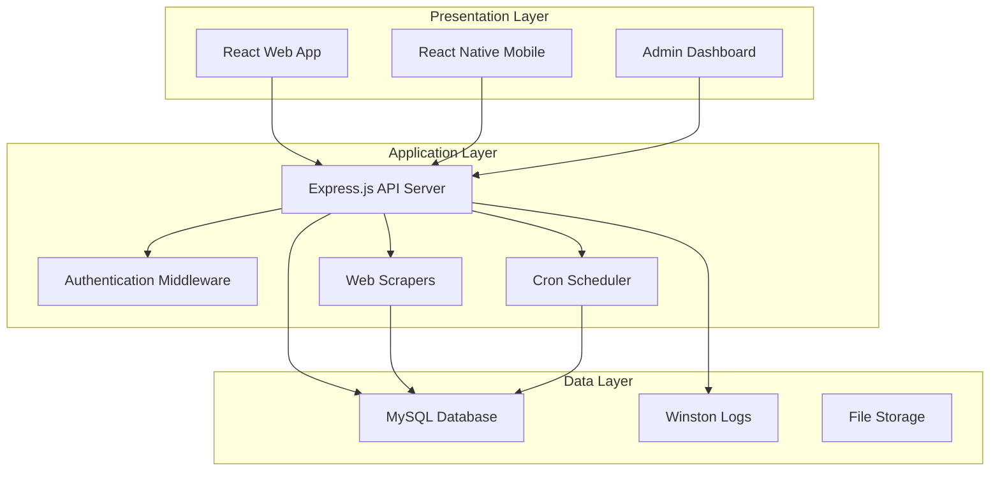
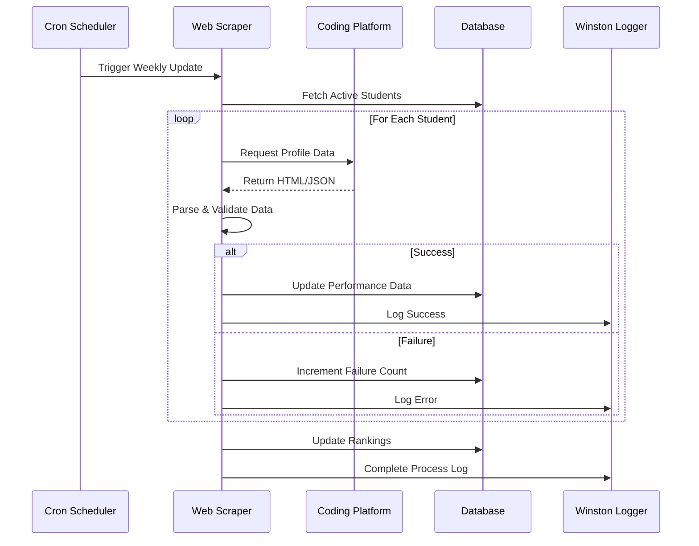
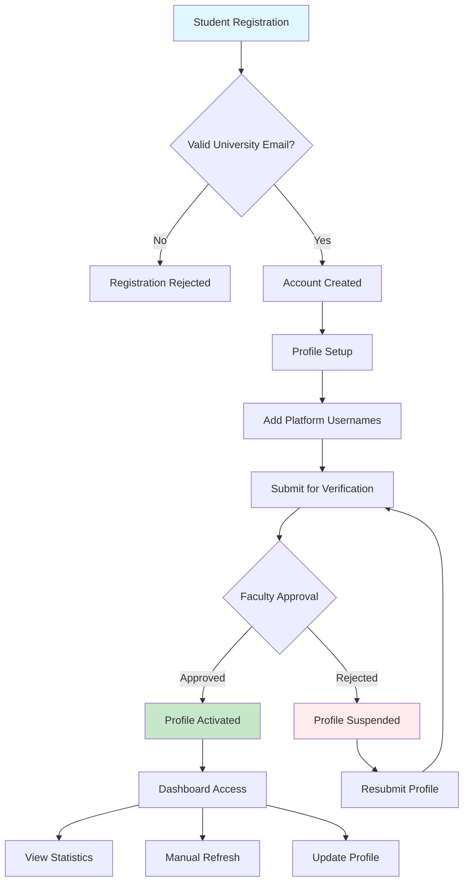
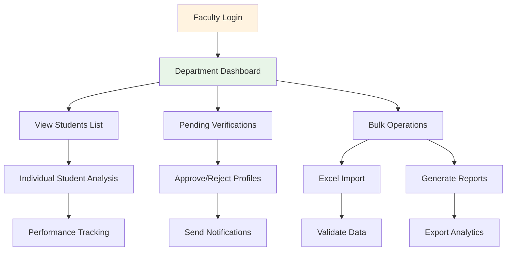
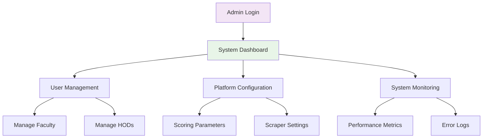
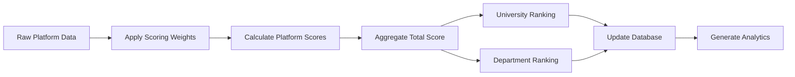
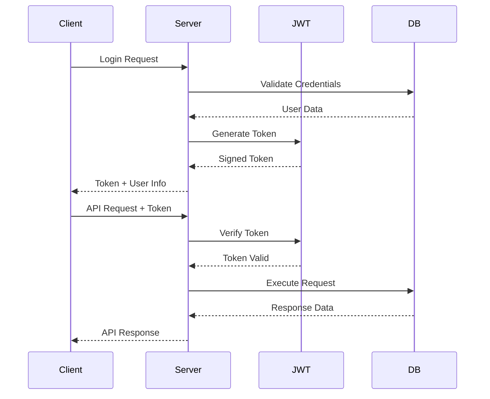
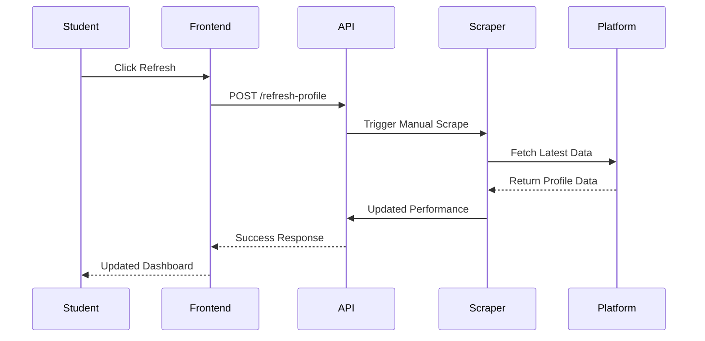

# Code to Win - Methodology and Workflow

## 📋 Table of Contents
- [System Methodology](#system-methodology)
- [Technical Architecture](#technical-architecture)
- [Data Collection Workflow](#data-collection-workflow)
- [User Workflow](#user-workflow)
- [Scoring Algorithm](#scoring-algorithm)
- [Security Framework](#security-framework)

## 🔬 System Methodology

### Core Approach
Code to Win employs a **multi-platform aggregation methodology** that consolidates coding performance data from disparate programming platforms into a unified scoring system. The approach combines automated web scraping, real-time data processing, and configurable ranking algorithms to provide comprehensive student assessment.

### Design Principles
1. **Platform Agnostic**: Modular scraper design allows easy addition of new coding platforms
2. **Real-time Processing**: Immediate data updates with manual refresh capabilities
3. **Scalable Architecture**: Microservices approach for independent component scaling
4. **Role-based Access**: Hierarchical user management with appropriate permissions
5. **Data Integrity**: Multi-level validation and error handling mechanisms

## 🏗️ Technical Architecture

### Three-Tier Architecture



### Technology Stack
- **Frontend**: React.js + Vite, TailwindCSS, Context API
- **Backend**: Node.js + Express.js, JWT Authentication
- **Database**: MySQL with optimized indexing
- **Scraping**: Cheerio, Axios, Puppeteer
- **Scheduling**: Node-cron for automated tasks
- **Logging**: Winston for comprehensive monitoring

## 🔄 Data Collection Workflow

### Automated Scraping Process



### Platform-Specific Scrapers

#### LeetCode Scraper
```javascript
// Methodology: GraphQL API + HTML parsing
1. Fetch user profile via GraphQL endpoint
2. Extract problems solved (Easy/Medium/Hard)
3. Parse contest participation data
4. Collect badges and achievements
```

#### CodeChef Scraper
```javascript
// Methodology: HTML parsing + API calls
1. Parse public profile page
2. Extract star rating and contest data
3. Collect problem-solving statistics
4. Handle rate limiting with delays
```

#### GeeksforGeeks Scraper
```javascript
// Methodology: Profile page parsing
1. Navigate to user profile
2. Extract difficulty-wise problem counts
3. Parse practice statistics
4. Handle dynamic content loading
```

#### HackerRank Scraper
```javascript
// Methodology: Public API + profile parsing
1. Fetch profile via public endpoints
2. Extract skill ratings and badges
3. Parse certification data
4. Handle authentication requirements
```

## 👥 User Workflow

### Student Journey



### Faculty Workflow



### Administrative Workflow



## 📊 Scoring Algorithm

### Weighted Scoring Methodology

```javascript
// Configurable scoring formula
totalScore = Σ(platformScore × platformWeight)

where:
platformScore = Σ(metricValue × metricWeight)

// Example calculation
leetcodeScore = (easy × 1) + (medium × 3) + (hard × 5) + (contests × 10)
codechefScore = (problems × 2) + (rating × 0.1) + (stars × 20)
gfgScore = (school × 0.5) + (basic × 1) + (easy × 2) + (medium × 4) + (hard × 6)
hackerrankScore = (stars × 15) + (badges × 5)
```

### Ranking Calculation Process



### Dynamic Weight Configuration
- Weights stored in `grading_system` table
- Real-time updates without system restart
- Department-specific weight customization
- Historical weight tracking for consistency

## 🔒 Security Framework

### Authentication Flow



### Security Measures

#### Input Validation
```javascript
// Multi-layer validation approach
1. Frontend validation (immediate feedback)
2. API middleware validation (sanitization)
3. Database constraint validation (data integrity)
```

#### SQL Injection Prevention
```javascript
// Parameterized queries only
const query = 'SELECT * FROM users WHERE id = ? AND role = ?';
db.execute(query, [userId, userRole]);
```

#### Rate Limiting
```javascript
// Platform-specific rate limits
leetcode: 1 request/second
codechef: 1 request/2 seconds
gfg: 1 request/3 seconds
hackerrank: 1 request/second
```

### Data Protection
- JWT tokens with expiration
- Role-based access control (RBAC)
- Encrypted sensitive data storage
- Audit logging for all operations

## 📈 Performance Optimization

### Database Optimization
```sql
-- Optimized indexing strategy
CREATE INDEX idx_student_performance ON student_performance(student_id, platform, updated_at);
CREATE INDEX idx_rankings ON rankings(university_rank, department_rank);
CREATE INDEX idx_user_role ON users(role, is_active);
```

### Caching Strategy
```javascript
// Node-cache implementation
const cache = new NodeCache({ stdTTL: 600 }); // 10-minute cache
- User profiles: 10 minutes
- Department data: 30 minutes
- University rankings: 1 hour
```

### Scraping Optimization
- Concurrent processing with controlled parallelism
- Exponential backoff for failed requests
- Profile suspension for repeated failures
- Batch database updates for efficiency

## 🔍 Monitoring and Analytics

### System Monitoring
```javascript
// Winston logging levels
error: System failures, scraping errors
warn: Rate limit warnings, validation failures  
info: Successful operations, user activities
debug: Detailed execution traces
```

### Performance Metrics
- Scraping success rates per platform
- API response times
- Database query performance
- User engagement analytics

### Error Handling
```javascript
// Comprehensive error recovery
1. Automatic retry with exponential backoff
2. Profile suspension after 5 consecutive failures
3. Email notifications for critical errors
4. Detailed error logging with stack traces
```

## 🎯 Implementation Strategy

### Development Phases

#### Phase 1: Core Infrastructure
- Database schema design and implementation
- Basic authentication and user management
- RESTful API development
- Frontend framework setup

#### Phase 2: Platform Integration
- Web scraper development for each platform
- Data validation and normalization
- Error handling and retry mechanisms
- Automated scheduling implementation

#### Phase 3: Analytics and Reporting
- Scoring algorithm implementation
- Ranking calculation system
- Dashboard development
- Report generation features

#### Phase 4: Advanced Features
- Mobile application development
- Real-time notifications
- Advanced analytics
- Performance optimization

### Quality Assurance Methodology

#### Testing Strategy
```javascript
// Multi-level testing approach
1. Unit Testing: Individual component validation
2. Integration Testing: API and database interactions
3. End-to-End Testing: Complete user workflows
4. Performance Testing: Load and stress testing
5. Security Testing: Vulnerability assessments
```

#### Continuous Integration
- Automated testing on code commits
- Code quality checks with ESLint
- Security vulnerability scanning
- Performance regression testing

## 🔄 Data Synchronization

### Real-time Updates


### Data Consistency
- Transaction-based database operations
- Atomic updates for related records
- Rollback mechanisms for failed operations
- Data integrity constraints

### Conflict Resolution
```javascript
// Handling concurrent updates
1. Optimistic locking for user profiles
2. Last-write-wins for performance data
3. Merge strategies for conflicting changes
4. Audit trails for data modifications
```

## 📊 Analytics Framework

### Key Performance Indicators (KPIs)

#### Student Metrics
- Total problems solved across platforms
- Difficulty progression over time
- Contest participation rates
- Platform engagement levels

#### Institutional Metrics
- Department-wise performance comparisons
- Year-over-year improvement trends
- Platform adoption rates
- Student engagement analytics

#### System Metrics
- Scraping success rates
- API response times
- Database performance
- User activity patterns

### Predictive Analytics
```javascript
// Future enhancement capabilities
1. Performance trend prediction
2. Placement success probability
3. Skill gap identification
4. Personalized learning recommendations
```

## 🚀 Scalability Considerations

### Horizontal Scaling
- Load balancer implementation
- Database sharding strategies
- Microservices architecture
- Container orchestration

### Vertical Scaling
- Resource optimization
- Query performance tuning
- Caching layer enhancement
- Memory management

### Cloud Deployment
```yaml
# Deployment architecture
Load Balancer:
  - Multiple API server instances
  - Health check endpoints
  - Auto-scaling policies

Database:
  - Master-slave replication
  - Read replicas for analytics
  - Automated backups

Caching:
  - Redis cluster for session storage
  - CDN for static assets
  - Application-level caching
```

## 🔐 Compliance and Privacy

### Data Privacy
- GDPR compliance for EU users
- Data anonymization for analytics
- User consent management
- Right to data deletion

### Security Standards
- OWASP Top 10 compliance
- Regular security audits
- Penetration testing
- Vulnerability assessments

### Audit Requirements
```javascript
// Comprehensive audit logging
1. User authentication events
2. Data access and modifications
3. System configuration changes
4. Security-related incidents
```

## 📈 Future Enhancements

### Machine Learning Integration
- Performance prediction models
- Anomaly detection in scraping
- Personalized recommendations
- Automated difficulty assessment

### Advanced Analytics
- Real-time dashboards
- Interactive data visualization
- Custom report builders
- Export capabilities

### Platform Expansion
- Additional coding platforms
- International platform support
- Custom platform integration
- API-based data collection

---

**This comprehensive methodology ensures robust, scalable, and maintainable system development while addressing all aspects of modern software engineering practices.**rm
- API response times
- Database query performance
- User engagement analytics

### Error Handling
```javascript
// Comprehensive error recovery
1. Automatic retry with exponential backoff
2. Profile suspension after 5 consecutive failures
3. Email notifications for critical errors
4. Detailed error logging with stack traces
```

---

**This methodology ensures reliable, scalable, and secure operation while providing comprehensive insights for academic institutions.**