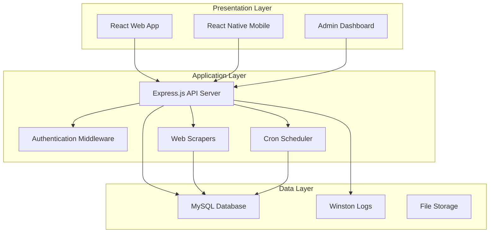
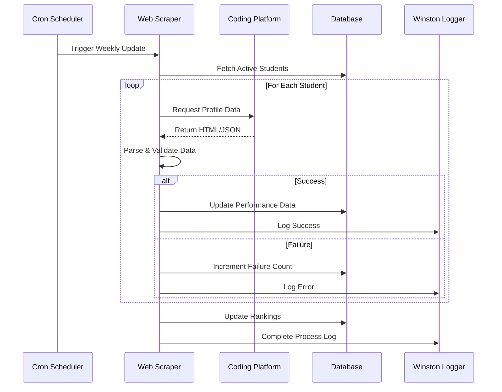
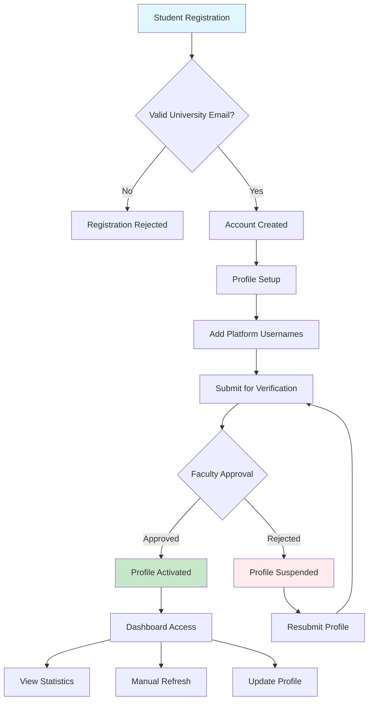
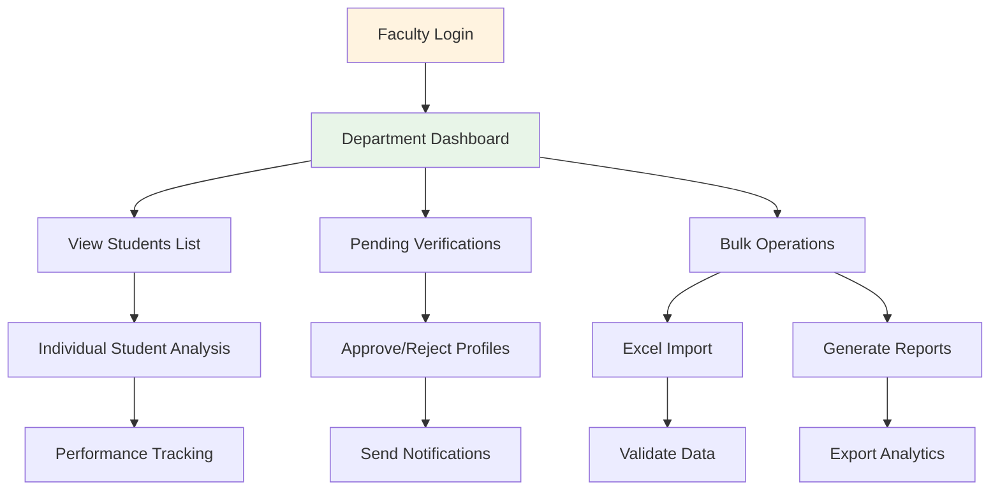
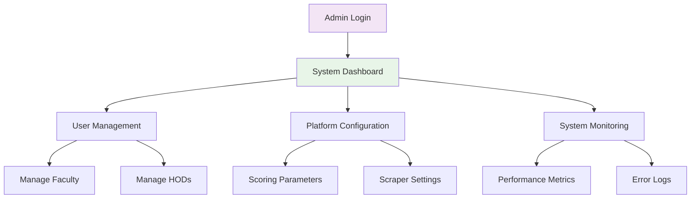
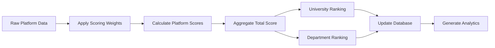
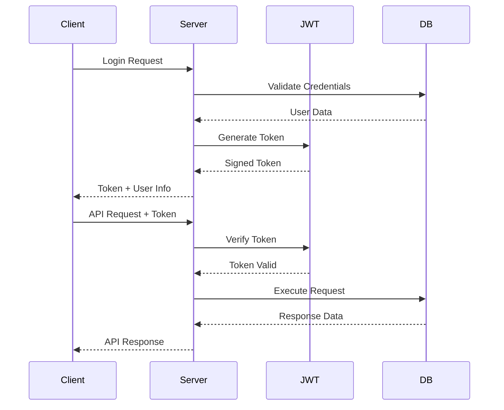
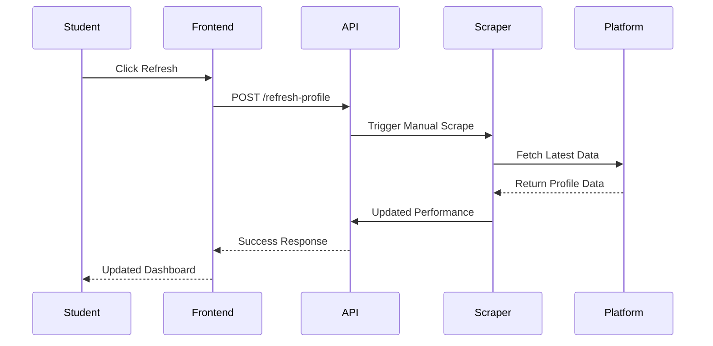

# Code to Win - Methodology and Workflow

## 📋 Table of Contents
- [System Methodology](#system-methodology)
- [Technical Architecture](#technical-architecture)
- [Data Collection Workflow](#data-collection-workflow)
- [User Workflow](#user-workflow)
- [Scoring Algorithm](#scoring-algorithm)
- [Security Framework](#security-framework)

## 🔬 System Methodology

### Core Approach
Code to Win employs a **multi-platform aggregation methodology** that consolidates coding performance data from disparate programming platforms into a unified scoring system. The methodology is built upon the principle of creating a centralized hub that can seamlessly integrate with multiple competitive programming platforms while maintaining data consistency and reliability. This approach addresses the fundamental challenge faced by educational institutions in tracking student progress across various coding platforms by providing a single, comprehensive dashboard that aggregates performance metrics from LeetCode, CodeChef, GeeksforGeeks, and HackerRank.

The system utilizes a sophisticated web scraping framework combined with real-time data processing capabilities to ensure that student performance data remains current and accurate. The methodology incorporates automated scheduling mechanisms that perform weekly data collection cycles, ensuring minimal manual intervention while maintaining high data quality standards. This approach enables educational institutions to monitor student coding progress effectively without requiring students to manually report their achievements across different platforms.

### Design Principles
The development methodology follows five core design principles that ensure system reliability, scalability, and maintainability. **Platform Agnostic Design** forms the foundation of the system architecture, where each coding platform is treated as an independent module with its own scraping logic and data processing mechanisms. This modular approach allows for easy integration of new platforms without affecting existing functionality, making the system future-proof and adaptable to emerging coding platforms.

**Real-time Processing** capabilities ensure that users can access up-to-date information about their coding performance. The system implements both automated weekly updates and manual refresh options, allowing students to trigger immediate data synchronization when needed. This dual approach balances system resource utilization with user convenience, ensuring that critical updates are available when required while maintaining optimal performance during regular operations.

**Scalable Architecture** principles guide the system design to handle growing user bases and increasing data volumes. The methodology employs a microservices approach where different components can be scaled independently based on demand. Database optimization strategies, including proper indexing and query optimization, ensure that the system maintains responsive performance even as the user base expands across multiple educational institutions.

**Role-based Access Control** methodology ensures that different user types have appropriate access levels and functionality. The system implements a hierarchical permission structure where students can manage their profiles and view their performance, faculty members can monitor departmental students and perform bulk operations, HODs can access college-wide analytics, and administrators have complete system control. This methodology ensures data security while providing relevant functionality to each user role.

**Data Integrity** mechanisms are embedded throughout the system to ensure accuracy and consistency of collected information. Multi-level validation processes verify data at collection, processing, and storage stages. Error handling mechanisms include retry logic with exponential backoff, profile suspension for repeated failures, and comprehensive logging for troubleshooting and system monitoring.

## 🏗️ Technical Architecture

### Three-Tier Architecture



### Technology Stack
- **Frontend**: React.js + Vite, TailwindCSS, Context API
- **Backend**: Node.js + Express.js, JWT Authentication
- **Database**: MySQL with optimized indexing
- **Scraping**: Cheerio, Axios, Puppeteer
- **Scheduling**: Node-cron for automated tasks
- **Logging**: Winston for comprehensive monitoring

## 🔄 Data Collection Workflow

### Automated Scraping Process



### Platform-Specific Scrapers

#### LeetCode Scraper
```javascript
// Methodology: GraphQL API + HTML parsing
1. Fetch user profile via GraphQL endpoint
2. Extract problems solved (Easy/Medium/Hard)
3. Parse contest participation data
4. Collect badges and achievements
```

#### CodeChef Scraper
```javascript
// Methodology: HTML parsing + API calls
1. Parse public profile page
2. Extract star rating and contest data
3. Collect problem-solving statistics
4. Handle rate limiting with delays
```

#### GeeksforGeeks Scraper
```javascript
// Methodology: Profile page parsing
1. Navigate to user profile
2. Extract difficulty-wise problem counts
3. Parse practice statistics
4. Handle dynamic content loading
```

#### HackerRank Scraper
```javascript
// Methodology: Public API + profile parsing
1. Fetch profile via public endpoints
2. Extract skill ratings and badges
3. Parse certification data
4. Handle authentication requirements
```

## 👥 User Workflow

### Student Journey



### Faculty Workflow



### Administrative Workflow



## 📊 Scoring Algorithm

### Weighted Scoring Methodology

```javascript
// Configurable scoring formula
totalScore = Σ(platformScore × platformWeight)

where:
platformScore = Σ(metricValue × metricWeight)

// Example calculation
leetcodeScore = (easy × 1) + (medium × 3) + (hard × 5) + (contests × 10)
codechefScore = (problems × 2) + (rating × 0.1) + (stars × 20)
gfgScore = (school × 0.5) + (basic × 1) + (easy × 2) + (medium × 4) + (hard × 6)
hackerrankScore = (stars × 15) + (badges × 5)
```

### Ranking Calculation Process



### Dynamic Weight Configuration
- Weights stored in `grading_system` table
- Real-time updates without system restart
- Department-specific weight customization
- Historical weight tracking for consistency

## 🔒 Security Framework

### Authentication Flow



### Security Measures

#### Input Validation
```javascript
// Multi-layer validation approach
1. Frontend validation (immediate feedback)
2. API middleware validation (sanitization)
3. Database constraint validation (data integrity)
```

#### SQL Injection Prevention
```javascript
// Parameterized queries only
const query = 'SELECT * FROM users WHERE id = ? AND role = ?';
db.execute(query, [userId, userRole]);
```

#### Rate Limiting
```javascript
// Platform-specific rate limits
leetcode: 1 request/second
codechef: 1 request/2 seconds
gfg: 1 request/3 seconds
hackerrank: 1 request/second
```

### Data Protection
- JWT tokens with expiration
- Role-based access control (RBAC)
- Encrypted sensitive data storage
- Audit logging for all operations

## 📈 Performance Optimization

### Database Optimization
```sql
-- Optimized indexing strategy
CREATE INDEX idx_student_performance ON student_performance(student_id, platform, updated_at);
CREATE INDEX idx_rankings ON rankings(university_rank, department_rank);
CREATE INDEX idx_user_role ON users(role, is_active);
```

### Caching Strategy
```javascript
// Node-cache implementation
const cache = new NodeCache({ stdTTL: 600 }); // 10-minute cache
- User profiles: 10 minutes
- Department data: 30 minutes
- University rankings: 1 hour
```

### Scraping Optimization
- Concurrent processing with controlled parallelism
- Exponential backoff for failed requests
- Profile suspension for repeated failures
- Batch database updates for efficiency

## 🔍 Monitoring and Analytics

### System Monitoring
```javascript
// Winston logging levels
error: System failures, scraping errors
warn: Rate limit warnings, validation failures  
info: Successful operations, user activities
debug: Detailed execution traces
```

### Performance Metrics
The monitoring methodology tracks comprehensive performance metrics that provide insights into system health and user engagement. **Scraping Success Rates** are monitored per platform to identify potential issues with data collection processes. These metrics help the system administrators proactively address problems before they affect user experience significantly.

**API Response Times** are continuously monitored to ensure that the system maintains responsive performance for all user interactions. Database query performance metrics help identify optimization opportunities and ensure that the system can handle growing data volumes efficiently. **User Engagement Analytics** provide insights into how different user roles interact with the system, helping guide future feature development and user experience improvements.

### Error Handling and Recovery
The error handling methodology implements comprehensive recovery mechanisms that ensure system resilience in the face of various failure scenarios. **Automatic Retry Logic** with exponential backoff strategies handles temporary network issues and platform unavailability without requiring manual intervention. **Profile Suspension Mechanisms** temporarily disable problematic profiles after repeated failures, preventing system resources from being wasted on consistently failing operations while allowing for manual review and resolution.

**Email Notification Systems** alert administrators to critical errors that require immediate attention, ensuring that system issues are addressed promptly. **Detailed Error Logging** with stack traces provides comprehensive information for troubleshooting and system improvement, enabling developers to identify and fix issues quickly.

### Data Synchronization and Consistency
The data synchronization methodology ensures that information remains consistent across all system components while providing real-time updates when needed. **Transaction-based Database Operations** ensure that related data updates are performed atomically, preventing data inconsistencies that could affect ranking calculations or user profiles.

**Conflict Resolution Strategies** handle scenarios where concurrent updates might occur, using optimistic locking for user profiles and last-write-wins strategies for performance data. **Audit Trails** track all data modifications, providing accountability and enabling recovery from data corruption or unauthorized changes.

### Scalability and Performance Optimization
The scalability methodology addresses both horizontal and vertical scaling requirements to ensure that the system can grow with institutional needs. **Database Optimization** strategies include proper indexing, query optimization, and connection pooling to maintain responsive performance as data volumes increase. **Caching Mechanisms** reduce database load for frequently accessed data while ensuring that users receive up-to-date information when needed.

**Load Balancing** strategies distribute system load across multiple server instances, ensuring that the system can handle peak usage periods without performance degradation. **Resource Monitoring** provides insights into system resource utilization, enabling proactive scaling decisions before performance issues affect users.

This comprehensive methodology ensures that the Code to Win platform provides reliable, scalable, and secure service while delivering valuable insights to educational institutions for tracking and improving student coding performance across multiple platforms.rm
- API response times
- Database query performance
- User engagement analytics

### Error Handling
```javascript
// Comprehensive error recovery
1. Automatic retry with exponential backoff
2. Profile suspension after 5 consecutive failures
3. Email notifications for critical errors
4. Detailed error logging with stack traces
```

## 🎯 Implementation Strategy

### Development Phases

#### Phase 1: Core Infrastructure
- Database schema design and implementation
- Basic authentication and user management
- RESTful API development
- Frontend framework setup

#### Phase 2: Platform Integration
- Web scraper development for each platform
- Data validation and normalization
- Error handling and retry mechanisms
- Automated scheduling implementation

#### Phase 3: Analytics and Reporting
- Scoring algorithm implementation
- Ranking calculation system
- Dashboard development
- Report generation features

#### Phase 4: Advanced Features
- Mobile application development
- Real-time notifications
- Advanced analytics
- Performance optimization

### Quality Assurance Methodology

#### Testing Strategy
```javascript
// Multi-level testing approach
1. Unit Testing: Individual component validation
2. Integration Testing: API and database interactions
3. End-to-End Testing: Complete user workflows
4. Performance Testing: Load and stress testing
5. Security Testing: Vulnerability assessments
```

#### Continuous Integration
- Automated testing on code commits
- Code quality checks with ESLint
- Security vulnerability scanning
- Performance regression testing

## 🔄 Data Synchronization

### Real-time Updates


### Data Consistency
- Transaction-based database operations
- Atomic updates for related records
- Rollback mechanisms for failed operations
- Data integrity constraints

### Conflict Resolution
```javascript
// Handling concurrent updates
1. Optimistic locking for user profiles
2. Last-write-wins for performance data
3. Merge strategies for conflicting changes
4. Audit trails for data modifications
```

## 📊 Analytics Framework

### Key Performance Indicators (KPIs)

#### Student Metrics
- Total problems solved across platforms
- Difficulty progression over time
- Contest participation rates
- Platform engagement levels

#### Institutional Metrics
- Department-wise performance comparisons
- Year-over-year improvement trends
- Platform adoption rates
- Student engagement analytics

#### System Metrics
- Scraping success rates
- API response times
- Database performance
- User activity patterns

### Predictive Analytics
```javascript
// Future enhancement capabilities
1. Performance trend prediction
2. Placement success probability
3. Skill gap identification
4. Personalized learning recommendations
```

## 🚀 Scalability Considerations

### Horizontal Scaling
- Load balancer implementation
- Database sharding strategies
- Microservices architecture
- Container orchestration

### Vertical Scaling
- Resource optimization
- Query performance tuning
- Caching layer enhancement
- Memory management

### Cloud Deployment
```yaml
# Deployment architecture
Load Balancer:
  - Multiple API server instances
  - Health check endpoints
  - Auto-scaling policies

Database:
  - Master-slave replication
  - Read replicas for analytics
  - Automated backups

Caching:
  - Redis cluster for session storage
  - CDN for static assets
  - Application-level caching
```

## 🔐 Compliance and Privacy

### Data Privacy
- GDPR compliance for EU users
- Data anonymization for analytics
- User consent management
- Right to data deletion

### Security Standards
- OWASP Top 10 compliance
- Regular security audits
- Penetration testing
- Vulnerability assessments

### Audit Requirements
```javascript
// Comprehensive audit logging
1. User authentication events
2. Data access and modifications
3. System configuration changes
4. Security-related incidents
```

## 📈 Future Enhancements

### Machine Learning Integration
- Performance prediction models
- Anomaly detection in scraping
- Personalized recommendations
- Automated difficulty assessment

### Advanced Analytics
- Real-time dashboards
- Interactive data visualization
- Custom report builders
- Export capabilities

### Platform Expansion
- Additional coding platforms
- International platform support
- Custom platform integration
- API-based data collection

---

**This comprehensive methodology ensures robust, scalable, and maintainable system development while addressing all aspects of modern software engineering practices.**rm
- API response times
- Database query performance
- User engagement analytics

### Error Handling
```javascript
// Comprehensive error recovery
1. Automatic retry with exponential backoff
2. Profile suspension after 5 consecutive failures
3. Email notifications for critical errors
4. Detailed error logging with stack traces
```

---

**This methodology ensures reliable, scalable, and secure operation while providing comprehensive insights for academic institutions.**