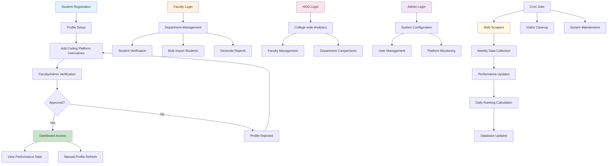
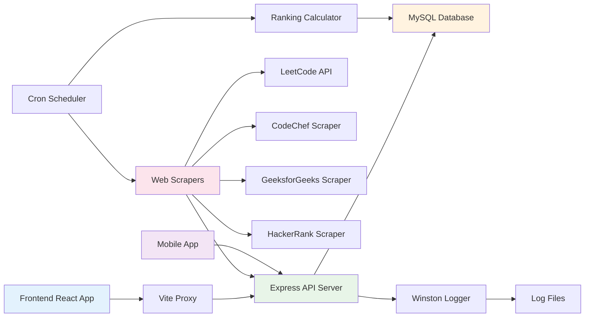

# Code to Win - Unified Coding Platform Dashboard

A comprehensive platform that aggregates coding statistics from multiple programming platforms (LeetCode, CodeChef, GeeksforGeeks, HackerRank) into a single dashboard for university placement tracking and student performance monitoring.

## 🎯 Project Overview

Code to Win is designed to help universities track student coding performance across different platforms, providing a unified scoring system for placement preparation and academic assessment. The platform serves multiple user roles including students, faculty, HODs, and administrators.

## 🏗️ Architecture

The project follows a multi-platform architecture:

- **Backend**: Node.js/Express REST API with MySQL database
- **Frontend**: React.js web application with Vite
- **Mobile**: React Native/Expo cross-platform mobile app
- **Database**: MySQL with automated scraping and ranking systems

## 📁 Project Structure

```
code_to_win/
├── backend/           # Node.js API server
│   ├── config/        # Database configuration
│   ├── routes/        # API route handlers
│   ├── scrapers/      # Platform-specific web scrapers
│   ├── middleware/    # Authentication & logging
│   └── logs/          # Application logs
├── client/            # React web application
│   ├── src/
│   │   ├── pages/     # Page components
│   │   ├── components/# Reusable UI components
│   │   └── context/   # React context providers
└── mobile/            # React Native mobile app
    ├── src/
    │   ├── screens/   # Mobile screens
    │   ├── components/# Mobile UI components
    │   └── contexts/  # Mobile context providers
```

## ✨ Key Features

### 🎓 Multi-Role Dashboard System
- **Students**: Personal coding statistics, profile management, platform integration
- **Faculty**: Department-wise student monitoring, bulk imports, performance tracking
- **HOD**: College-level analytics, faculty management, comprehensive reports
- **Admin**: System-wide management, user verification, platform configuration

### 📊 Platform Integration
- **LeetCode**: Problems solved (Easy/Medium/Hard), contests participated, badges earned
- **CodeChef**: Contest participation, star ratings, problems solved, badges
- **GeeksforGeeks**: Difficulty-wise problem solving (School/Basic/Easy/Medium/Hard)
- **HackerRank**: Star ratings and skill badges

### 🔄 Automated Data Collection
- **Web Scraping**: Automated profile data extraction from coding platforms
- **Scheduled Updates**: Weekly performance updates and daily ranking calculations
- **Real-time Refresh**: Manual profile refresh capability for students
- **Error Handling**: Robust retry mechanisms and suspension/reactivation system

### 📈 Scoring & Ranking System
- **Configurable Scoring**: Weighted scoring system based on platform performance
- **University Rankings**: Overall student rankings within the institution
- **Department Analytics**: Department-wise performance comparisons
- **Progress Tracking**: Historical performance monitoring

## 🚀 Getting Started

### Prerequisites
- Node.js (v16 or higher)
- MySQL (v8.0 or higher)
- npm or yarn package manager

### Backend Setup

1. **Navigate to backend directory**
   ```bash
   cd backend
   ```

2. **Install dependencies**
   ```bash
   npm install
   ```

3. **Environment Configuration**
   Create a `.env` file with the following variables:
   ```env
   DB_HOST=localhost
   DB_USER=your_mysql_username
   DB_PASS=your_mysql_password
   DB_NAME=code_to_win_db
   PORT=5000
   JWT_SECRET=your_jwt_secret
   ```

4. **Database Setup**
   - Create MySQL database
   - Import the database schema (contact admin for schema file)
   - Run initial data seeding if available

5. **Start the server**
   ```bash
   npm run dev
   ```

### Frontend Setup

1. **Navigate to client directory**
   ```bash
   cd client
   ```

2. **Install dependencies**
   ```bash
   npm install
   ```

3. **Start development server**
   ```bash
   npm run dev
   ```

4. **Access the application**
   Open `http://localhost:5173` in your browser

### Mobile App Setup

1. **Navigate to mobile directory**
   ```bash
   cd mobile
   ```

2. **Install dependencies**
   ```bash
   npm install
   ```

3. **Start Expo development server**
   ```bash
   npm start
   ```

4. **Run on device/simulator**
   - For Android: `npm run android`
   - For iOS: `npm run ios`

## 🔧 Configuration

### Grading System
The scoring system is configurable through the database `grading_system` table. Each metric can be assigned different point values:
- LeetCode problems (Easy/Medium/Hard)
- CodeChef contests and star ratings
- GeeksforGeeks problem difficulties
- HackerRank star ratings

### Scraping Schedule
- **Weekly Updates**: Every Saturday at midnight (configurable via cron)
- **Daily Rankings**: Every day at 3:00 AM (configurable via cron)
- **Manual Refresh**: Available to students for immediate updates

## 📱 User Workflows

### Student Journey
1. **Registration**: Create account with university credentials
2. **Profile Setup**: Add coding platform usernames
3. **Verification**: Wait for faculty/admin approval
4. **Dashboard Access**: View unified statistics and rankings
5. **Profile Management**: Update platform usernames and personal info

### Faculty Management
1. **Student Oversight**: Monitor department student performance
2. **Bulk Operations**: Import student data via Excel files
3. **Verification**: Approve/reject student coding profiles
4. **Analytics**: Generate department-wise reports

### Administrative Control
1. **System Management**: Configure scoring parameters
2. **User Management**: Manage faculty and HOD accounts
3. **Platform Monitoring**: Oversee scraping operations and system health
4. **Data Export**: Generate comprehensive reports and analytics

## 🔄 System Workflow Diagram



### Data Flow Architecture



## 🛠️ API Endpoints

### Authentication
- `POST /api/auth/login` - User authentication
- `POST /api/auth/register` - New user registration

### Student Operations
- `GET /api/student/profile` - Fetch student profile and performance
- `PUT /api/student/update-profile` - Update personal information
- `POST /api/student/coding-profile` - Submit coding platform usernames
- `POST /api/student/refresh-coding-profiles` - Manual performance refresh

### Faculty Operations
- `GET /api/faculty/students` - Get department students
- `POST /api/faculty/verify-profile` - Approve/reject coding profiles
- `POST /api/faculty/bulk-import` - Import student data

### Rankings & Analytics
- `GET /api/ranking/university` - University-wide rankings
- `GET /api/ranking/department` - Department-specific rankings
- `GET /api/export/students` - Export student data

## 🔒 Security Features

- **JWT Authentication**: Secure token-based authentication
- **Role-based Access Control**: Different permissions for each user type
- **Input Validation**: Comprehensive request validation
- **SQL Injection Protection**: Parameterized queries
- **Rate Limiting**: API rate limiting for scraping operations

## 📊 Monitoring & Logging

- **Winston Logging**: Comprehensive application logging
- **Error Tracking**: Detailed error logs with stack traces
- **Performance Monitoring**: Scraping operation success/failure tracking
- **User Activity**: Authentication and profile update logging

## 🚀 Deployment

### Production Environment
1. **Database**: Set up production MySQL instance
2. **Backend**: Deploy Node.js application (PM2 recommended)
3. **Frontend**: Build and deploy static files (Nginx/Apache)
4. **Mobile**: Build and distribute via app stores

### Environment Variables
Ensure all production environment variables are properly configured:
- Database credentials
- JWT secrets
- API rate limits
- Logging levels

## 🤝 Contributing

1. Fork the repository
2. Create a feature branch (`git checkout -b feature/amazing-feature`)
3. Commit your changes (`git commit -m 'Add amazing feature'`)
4. Push to the branch (`git push origin feature/amazing-feature`)
5. Open a Pull Request

## 📄 License

This project is licensed under the ISC License - see the LICENSE file for details.

## 🆘 Support

For support and questions:
- Create an issue in the repository
- Contact the development team
- Check the logs directory for troubleshooting information

## 🔮 Future Enhancements

- **Additional Platforms**: Integration with Codeforces, AtCoder, TopCoder
- **Advanced Analytics**: Machine learning-based performance predictions
- **Mobile Features**: Push notifications, offline mode
- **Gamification**: Achievement badges, leaderboards, challenges
- **API Integration**: Direct platform APIs instead of web scraping
- **Real-time Updates**: WebSocket-based live updates

---

**Built with ❤️ for university coding communities**