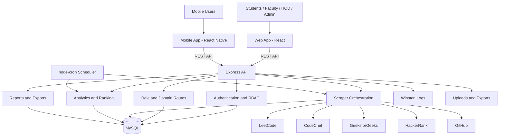
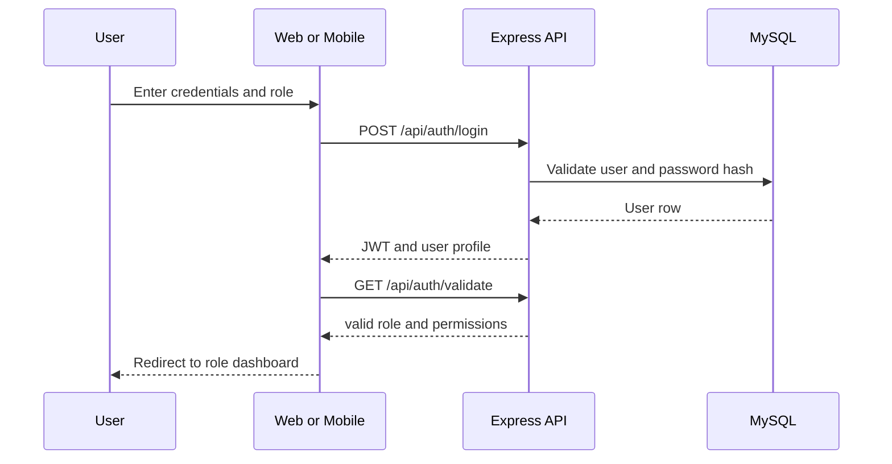
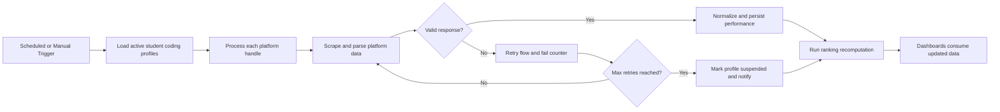
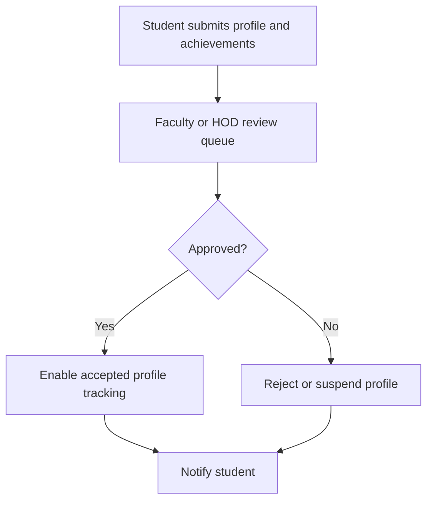
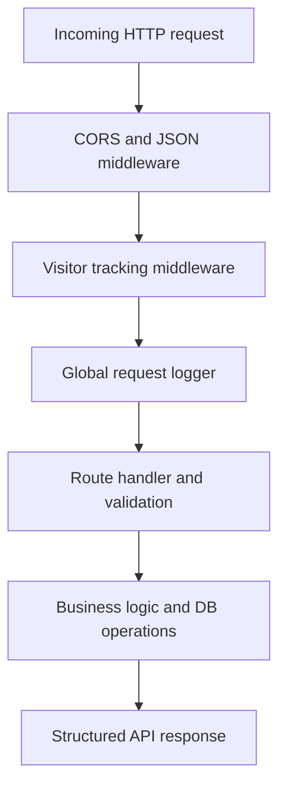
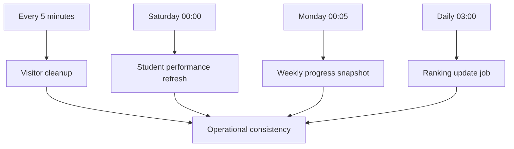
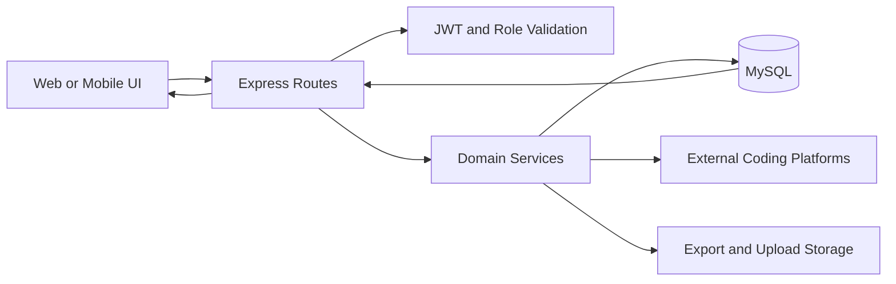

# Code to Win

<div align="center">
  <h2>Unified Coding Performance Intelligence Platform</h2>
  <p>
    A complete web and mobile system to collect coding activity, validate profiles,
    calculate rankings, and power role-based decision making for Students, Faculty, HOD, and Admin.
  </p>

  
  
  
  
  
  
</div>

---

## Table of Contents

1. [Project Overview](#project-overview)
2. [Core Objectives](#core-objectives)
3. [Tech Stack](#tech-stack)
4. [System Architecture](#system-architecture)
5. [Code Structure and Folder Organization](#code-structure-and-folder-organization)
6. [Workflow Explanation](#workflow-explanation)
7. [Execution Flow Diagrams](#execution-flow-diagrams)
8. [Setup and Installation](#setup-and-installation)
9. [Run Locally](#run-locally)
10. [Usage Instructions](#usage-instructions)
11. [Testing and Validation](#testing-and-validation)
12. [Production Readiness Checklist](#production-readiness-checklist)

---

## Project Overview

Code to Win addresses a common institutional problem: coding performance is fragmented across external platforms. This project unifies those signals into one governed system and converts raw activity into operational intelligence.

The platform supports:

- Consolidated tracking across LeetCode, CodeChef, GeeksforGeeks, HackerRank, and GitHub
- Role-based access control for Student, Faculty, HOD, and Admin
- Automated scraping and scheduled data refresh
- Ranking computation and analytics
- Exports, reports, and achievement workflows
- Shared backend APIs for web and mobile applications

---

## Core Objectives

- Build a reliable, multi-role coding analytics ecosystem
- Automate collection and normalization of coding profile data
- Provide transparent ranking and progress insights
- Support verification and governance workflows across departments
- Deliver a scalable architecture with clean separation of concerns

---

## Tech Stack

| Layer | Technologies | Why It Was Chosen |
|---|---|---|
| Web Frontend | React, Vite, Tailwind, React Router, React Query | Fast iteration, modular UI, optimized bundling |
| Mobile Frontend | React Native, Expo, NativeWind, React Navigation | Cross-platform delivery with shared domain concepts |
| Backend | Node.js, Express, node-cron, Winston | Clean API composition, scheduling, and observability |
| Database | MySQL, mysql2 | Relational consistency for users, profiles, scores, and roles |
| Auth and Security | JWT, bcryptjs | Stateless access and secure password verification |
| Data Collection | Axios, Cheerio, Puppeteer, Playwright Core | Handles static and dynamic platform data surfaces |
| Reporting | ExcelJS, XLSX, jsPDF, react-pdf | Export and reporting requirements for institution workflows |

---

## System Architecture


```mermaid
graph TD
  U1[Students / Faculty / HOD / Admin] --> W[Web App - React]
  U2[Mobile Users] --> M[Mobile App - React Native]

  W -->|REST API| B[Express API]
  M -->|REST API| B

  B --> A1[Authentication and RBAC]
  B --> A2[Role and Domain Routes]
  B --> A3[Scraper Orchestration]
  B --> A4[Analytics and Ranking]
  B --> A5[Reports and Exports]

  A1 --> DB[(MySQL)]
  A2 --> DB
  A3 --> DB
  A4 --> DB
  A5 --> DB

  A3 --> P1[LeetCode]
  A3 --> P2[CodeChef]
  A3 --> P3[GeeksforGeeks]
  A3 --> P4[HackerRank]
  A3 --> P5[GitHub]

  C[node-cron Scheduler] --> A3
  C --> A4
  B --> L[Winston Logs]
  B --> F[Uploads and Exports]
```

---

## Code Structure and Folder Organization

```text
code_to_win/
|-- backend/
|   |-- config/                 # DB and runtime configuration
|   |-- routes/                 # REST APIs by domain and role
|   |-- scrapers/               # Platform-specific scraper modules
|   |-- middleware/             # Upload handling and visitor tracking
|   |-- migrations/             # SQL migration files
|   |-- utils/                  # Shared backend helpers and services
|   |-- uploads/                # Stored certificates and assets
|   |-- exports/                # Generated report and excel files
|   `-- server.js               # API bootstrap + scheduled jobs
|-- client/
|   |-- src/
|   |   |-- pages/              # Route-driven screens
|   |   |-- components/         # Reusable UI components
|   |   |-- context/            # Auth and metadata state
|   |   `-- utils/              # Client-side helper logic
|   `-- vite.config.js          # Dev server proxy and build tuning
|-- mobile/
|   |-- src/
|   |   |-- screens/            # Mobile screen modules
|   |   |-- components/         # Mobile reusable components
|   |   |-- contexts/           # Mobile auth and app state
|   |   `-- navigation/         # Navigation stacks and tabs
|   `-- App.jsx                 # Mobile root entry
|-- README.md
|-- architecture.md
`-- projectdocumentation.md
```

---

## Workflow Explanation

### 1. Authentication and Role Routing


```mermaid
sequenceDiagram
  participant User
  participant Client as Web or Mobile
  participant API as Express API
  participant DB as MySQL

  User->>Client: Enter credentials and role
  Client->>API: POST /api/auth/login
  API->>DB: Validate user and password hash
  DB-->>API: User row
  API-->>Client: JWT and user profile
  Client->>API: GET /api/auth/validate
  API-->>Client: valid role and permissions
  Client-->>User: Redirect to role dashboard
```

### 2. Scraping and Performance Update Workflow


```mermaid
flowchart LR
  T[Scheduled or Manual Trigger] --> S[Load active student coding profiles]
  S --> P[Process each platform handle]
  P --> X[Scrape and parse platform data]
  X --> V{Valid response?}
  V -->|Yes| U[Normalize and persist performance]
  V -->|No| R[Retry flow and fail counter]
  R --> M{Max retries reached?}
  M -->|Yes| N[Mark profile suspended and notify]
  M -->|No| X
  U --> Q[Run ranking recomputation]
  N --> Q
  Q --> D[Dashboards consume updated data]
```

### 3. Governance and Verification Workflow


```mermaid
flowchart TD
  ST[Student submits profile and achievements] --> RV[Faculty or HOD review queue]
  RV --> AC{Approved?}
  AC -->|Yes| EN[Enable accepted profile tracking]
  AC -->|No| RE[Reject or suspend profile]
  EN --> NT[Notify student]
  RE --> NT
```

---

## Execution Flow Diagrams

### Request Lifecycle


```mermaid
flowchart TD
  R1[Incoming HTTP request] --> R2[CORS and JSON middleware]
  R2 --> R3[Visitor tracking middleware]
  R3 --> R4[Global request logger]
  R4 --> R5[Route handler and validation]
  R5 --> R6[Business logic and DB operations]
  R6 --> R7[Structured API response]
```

### Scheduled Jobs and Automation


```mermaid
flowchart TD
  C1[Every 5 minutes] --> J1[Visitor cleanup]
  C2[Saturday 00:00] --> J2[Student performance refresh]
  C3[Monday 00:05] --> J3[Weekly progress snapshot]
  C4[Daily 03:00] --> J4[Ranking update job]
  J1 --> O[Operational consistency]
  J2 --> O
  J3 --> O
  J4 --> O
```

### Data Flow Across Components


```mermaid
flowchart LR
  UI[Web or Mobile UI] --> API[Express Routes]
  API --> AUTH[JWT and Role Validation]
  API --> SERVICE[Domain Services]
  SERVICE --> DB[(MySQL)]
  SERVICE --> EXT[External Coding Platforms]
  SERVICE --> FILES[Export and Upload Storage]
  DB --> API
  API --> UI
```

---

## Setup and Installation

### Prerequisites

- Node.js 18 or later
- npm 9 or later
- MySQL 8 or later
- Expo CLI tooling for mobile development

### 1. Clone and install dependencies

```bash
git clone <repository-url>
cd code_to_win
npm install
cd backend && npm install
cd ../client && npm install
cd ../mobile && npm install
cd ..
```

Optional shortcut for root, backend, and client:

```bash
npm run install-all
```

### 2. Configure backend environment

Create backend/.env:

```env
DB_HOST=localhost
DB_USER=your_mysql_user
DB_PASS=your_mysql_password
DB_NAME=code_to_win
PORT=5000
JWT_SECRET=your_secure_jwt_secret
EMAIL_USER_1=sender_email_1
EMAIL_PASS_1=sender_email_password_1
EMAIL_USER_2=sender_email_2
EMAIL_PASS_2=sender_email_password_2
```

### 3. Initialize database

```sql
CREATE DATABASE code_to_win;
```

Then execute SQL scripts from backend/migrations and any required schema seed files for your environment.

### 4. Configure API endpoints

- Web proxy points to http://localhost:5000 in client/vite.config.js
- Mobile API base URL is set in mobile/src/utils.jsx and should be changed to your machine IP when testing on a physical device

---

## Run Locally

### Option A: Run backend and web together

```bash
npm run dev
```

This launches:

- Backend: nodemon server.js
- Web: Vite dev server

### Option B: Run each service manually

```bash
# terminal 1
cd backend
npm run dev

# terminal 2
cd client
npm run dev

# terminal 3 (optional)
cd mobile
npm start
```

### Local endpoints

- Web app: http://localhost:1432
- Backend API: http://localhost:5000
- Mobile app: Expo dev server via npm start in mobile

---

## Usage Instructions

### Student

1. Log in with student role.
2. View consolidated coding profile status.
3. Track ranking, recent progress, and notifications.
4. Submit or manage achievement artifacts where enabled.

### Faculty

1. Access section or department students.
2. Verify coding profiles and submitted evidence.
3. Monitor progress and generate exports.

### HOD

1. Review department-level performance analytics.
2. Validate oversight workflows and escalations.
3. Analyze rank distribution and trends.

### Admin

1. Manage global users and platform configurations.
2. Trigger governance and reporting tasks.
3. Review system-wide analytics and snapshots.

---

## Testing and Validation

### Backend script validation

```bash
cd backend
npm test
```

The backend test script performs syntax checks on JavaScript files.

### Recommended integration checks

- Validate login and token lifecycle on web and mobile
- Verify profile scraping for at least one account per platform
- Confirm ranking update reflects in dashboard APIs
- Generate at least one export and download successfully
- Confirm scheduled jobs run with expected log traces

---

## Production Readiness Checklist

- Environment variables configured per deployment stage
- Database migrations applied and verified
- API host and proxy values aligned across clients
- Logging retention and monitoring configured
- Cron jobs validated in production timezone
- Security review for JWT secret management and credential storage
- Backup strategy for database and exported artifacts

---

## Documentation Index

- architecture.md: Detailed system architecture and design decisions
- projectdocumentation.md: End-to-end technical and operational documentation

Code to Win is designed to remain maintainable, scalable, and governance-ready while delivering a polished, role-aware experience across web and mobile environments.
2. Connect/verify coding profiles
3. View dashboard cards + platform breakdown
4. Trigger manual refresh
5. Track rank and notifications

### Faculty / HOD

1. Access assigned cohort views
2. Review pending profile requests
3. Accept/reject/reactivate platform links
4. Analyze rankings and generate reports

### Admin

1. Manage users and roles
2. Monitor analytics and system health
3. Tune grading and operational settings
4. Use exports/reports for institutional workflows

---

## ✅ Quality & Validation Commands

```bash
# backend
cd backend && npm test

# client
cd client && npm run lint && npm run build

# mobile
cd mobile && npm run lint
```

---

## 📚 Documentation Index

- Architecture and system design: `architecture.md`
- Complete project documentation: `projectdocumentation.md`

---

## 🛠️ Common Troubleshooting

- **Proxy/API mismatch**: ensure backend port matches `client/vite.config.js` and mobile `API_URL`
- **Auth issues**: verify `JWT_SECRET` and token header formatting
- **Scraping gaps**: check platform username validity and scraper logs
- **DB errors**: verify MySQL credentials and schema migration state
- **Mobile connectivity**: use reachable LAN IP for physical devices

---

## 📄 License

This repository is currently configured as internal/project-specific. Add your preferred license if open-sourcing.
