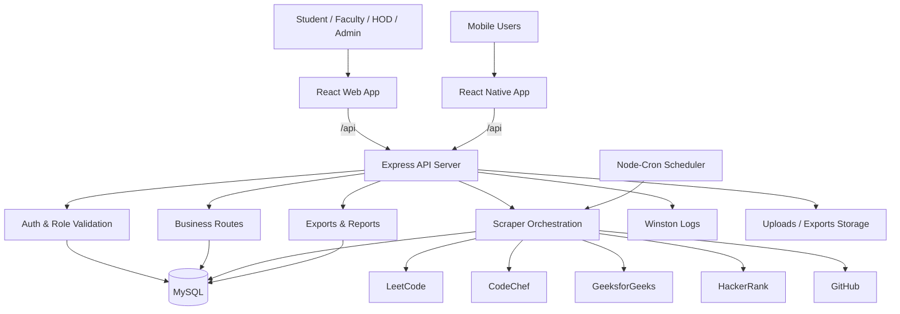
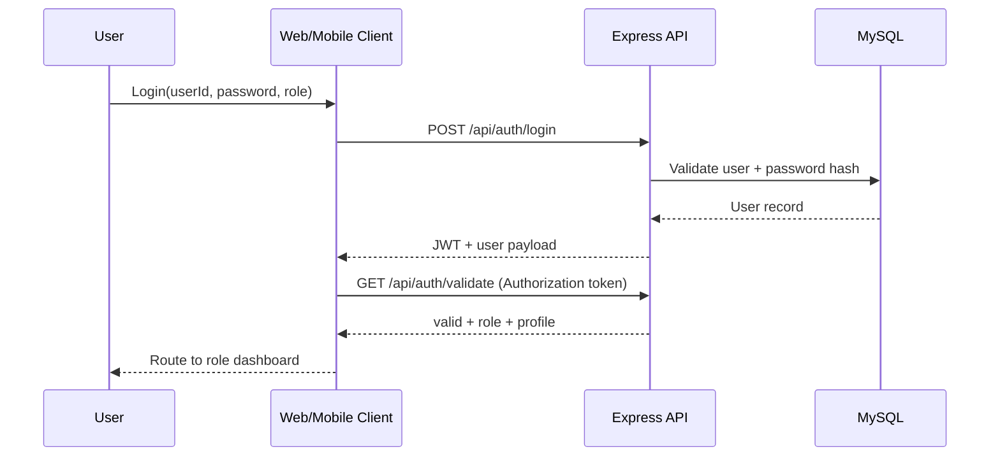
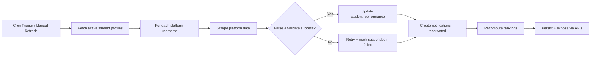
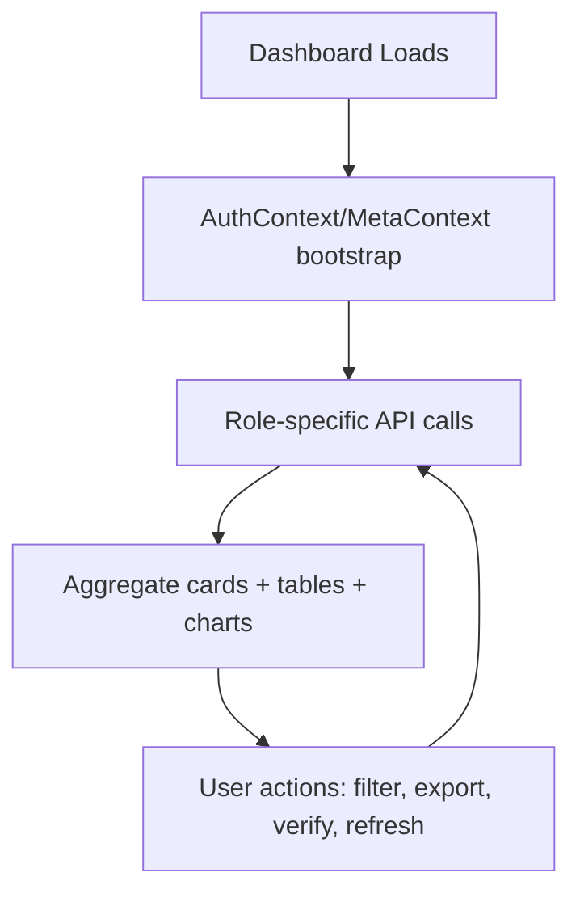
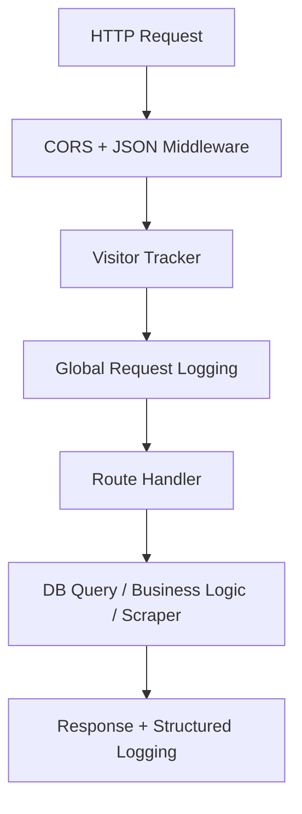

# 🚀 Code to Win

<div align="center">

### Unified Coding Performance Intelligence Platform

Aggregate, verify, score, and rank student coding performance across multiple platforms with role-based dashboards for Students, Faculty, HODs, and Admins.


</div>

---

## 📌 Project Overview

**Code to Win** solves a practical institutional problem: student coding performance is scattered across platforms like LeetCode, CodeChef, GeeksforGeeks, HackerRank, and GitHub. This project centralizes that data and converts it into actionable insights through:

- Automated scraping and scheduled updates
- A configurable scoring + ranking engine
- Role-aware dashboards and workflows
- Verification pipelines for coding profiles and achievements
- Reporting/export capabilities for placement and academic tracking

---

## ✨ What This Project Delivers

- 🎯 Unified coding performance view across platforms
- 🧠 Multi-role governance (Student, Faculty, HOD, Admin)
- 🔄 Automated cron-driven updates and ranking recalculation
- 🔐 JWT-based auth with role-specific route protection
- 📊 Rich analytics and report generation
- 📱 Web + Mobile clients over one backend API

---

## 🧰 Tech Stack

| Layer | Technologies | Why Used |
|---|---|---|
| Web Frontend | React, Vite, TailwindCSS, React Router | Fast UI iteration, optimized builds, modular pages |
| Mobile Frontend | React Native, Expo, NativeWind, React Navigation | Shared product surface for on-the-go users |
| Backend | Node.js, Express, node-cron, Winston | API orchestration, scheduling, observability |
| Data | MySQL (`mysql2`) | Structured relational model for users, profiles, scores |
| Scraping | Axios, Cheerio, Puppeteer/Playwright Core | Robust collection across varied platform page/API patterns |
| Auth/Security | JWT, bcryptjs | Stateless authentication and secure password handling |
| Export/Reports | ExcelJS, XLSX, PDF tooling | Placement and analytics workflows |

---

## 🏗️ Architecture at a Glance


```mermaid
graph TD
  U1[Student / Faculty / HOD / Admin] --> W[React Web App]
  U2[Mobile Users] --> M[React Native App]

  W -->|/api| B[Express API Server]
  M -->|/api| B

  B --> R1[Auth & Role Validation]
  B --> R2[Business Routes]
  B --> R3[Scraper Orchestration]
  B --> R4[Exports & Reports]

  R1 --> DB[(MySQL)]
  R2 --> DB
  R3 --> DB
  R4 --> DB

  C[Node-Cron Scheduler] --> R3
  R3 --> P1[LeetCode]
  R3 --> P2[CodeChef]
  R3 --> P3[GeeksforGeeks]
  R3 --> P4[HackerRank]
  R3 --> P5[GitHub]

  B --> L[Winston Logs]
  B --> F[Uploads / Exports Storage]
```

---

## 🗂️ Code Structure & Folder Organization

```text
code_to_win/
├── backend/
│   ├── config/                # DB and runtime config
│   ├── routes/                # REST modules by domain/role
│   ├── scrapers/              # Platform-specific collectors
│   ├── middleware/            # Upload + visitor tracking
│   ├── migrations/            # SQL migrations
│   ├── utils/                 # Shared helpers and reporting
│   ├── uploads/               # Certificates and uploaded files
│   ├── exports/               # Generated export artifacts
│   └── server.js              # API entrypoint + cron jobs
├── client/
│   ├── src/
│   │   ├── pages/             # Screens and dashboards
│   │   ├── components/        # Reusable UI blocks
│   │   ├── context/           # Auth + meta providers
│   │   └── utils/             # Client helpers
│   └── vite.config.js         # Dev server + proxy config
├── mobile/
│   ├── src/
│   │   ├── screens/           # Mobile screens
│   │   ├── components/        # Mobile UI components
│   │   ├── contexts/          # Mobile auth/meta state
│   │   └── navigation/        # Stack/tab navigation
│   └── App.jsx                # Mobile app root
└── README.md / architecture.md / projectdocumentation.md
```

---

## 🔄 Workflow Explanation

### 1) Authentication & Role Resolution


```mermaid
sequenceDiagram
  participant User
  participant Client as Web/Mobile Client
  participant API as Express API
  participant DB as MySQL

  User->>Client: Login(userId, password, role)
  Client->>API: POST /api/auth/login
  API->>DB: Validate user + password hash
  DB-->>API: User record
  API-->>Client: JWT + user payload
  Client->>API: GET /api/auth/validate (Authorization token)
  API-->>Client: valid + role + profile
  Client-->>User: Route to role dashboard
```

### 2) Scraping & Performance Update Cycle


```mermaid
flowchart LR
  A[Cron Trigger / Manual Refresh] --> B[Fetch active student profiles]
  B --> C[For each platform username]
  C --> D[Scrape platform data]
  D --> E{Parse + validate success?}
  E -->|Yes| F[Update student_performance]
  E -->|No| G[Retry + mark suspended if failed]
  F --> H[Create notifications if reactivated]
  G --> H
  H --> I[Recompute rankings]
  I --> J[Persist + expose via APIs]
```

### 3) Dashboard Data Retrieval


```mermaid
flowchart TD
  C1[Dashboard Loads] --> C2[AuthContext/MetaContext bootstrap]
  C2 --> C3[Role-specific API calls]
  C3 --> C4[Aggregate cards + tables + charts]
  C4 --> C5[User actions: filter, export, verify, refresh]
  C5 --> C3
```

---

## 🧭 Execution Flow Diagrams

### API Request Lifecycle


```mermaid
flowchart TD
  R1[HTTP Request] --> R2[CORS + JSON Middleware]
  R2 --> R3[Visitor Tracker]
  R3 --> R4[Global Request Logging]
  R4 --> R5[Route Handler]
  R5 --> R6[DB Query / Business Logic / Scraper]
  R6 --> R7[Response + Structured Logging]
```

### Scheduled Jobs Timeline


```mermaid
gantt
  title Scheduled Jobs (Server)
  dateFormat  HH:mm
  axisFormat %H:%M
  section Daily
  Ranking update                  :03:00, 10m
  Visitor cleanup (every 5 mins)  :active, 00:00, 24h
  section Weekly
  Student performance scraping    :sat, 00:00, 60m
  Weekly progress snapshot        :mon, 00:05, 15m
```

---

## ⚙️ Setup & Installation

## Prerequisites

- Node.js 18+
- npm 9+
- MySQL 8+
- Optional: PM2 for production process management
- Optional (mobile): Android Studio / Xcode + Expo tooling

## 1) Clone and install

```bash
git clone <your-repository-url>
cd code_to_win
npm install
cd backend && npm install
cd ../client && npm install
cd ../mobile && npm install
cd ..
```

> Root `npm run install-all` installs root + backend + client. Install mobile separately.

## 2) Configure backend environment

Create `backend/.env`:

```env
DB_HOST=localhost
DB_USER=your_mysql_user
DB_PASS=your_mysql_password
DB_NAME=code_to_win
PORT=5000
JWT_SECRET=your_jwt_secret
EMAIL_USER_1=optional_sender_1
EMAIL_PASS_1=optional_sender_1_password
EMAIL_USER_2=optional_sender_2
EMAIL_PASS_2=optional_sender_2_password
```

> Recommended `PORT=5000` because web proxy and mobile API defaults currently target port 5000.

## 3) Create database and run SQL

```sql
CREATE DATABASE code_to_win;
```

Then apply schema/migrations using SQL files in `backend/migrations/` and project SQL scripts.

## 4) Run services locally

### Option A (root web stack)

```bash
npm run dev
```

This starts backend (`backend`) and web client (`client`) concurrently.

### Option B (manual)

```bash
# terminal 1
cd backend
npm run dev

# terminal 2
cd client
npm run dev

# terminal 3 (optional mobile)
cd mobile
npm start
```

---

## ▶️ How to Run Locally (Quick Paths)

- Web App: open `http://localhost:1432`
- API Server: `http://localhost:5000`
- Mobile: Expo dev server via `npm start` inside `mobile`

If backend runs on a different host/port, update:

- `client/vite.config.js` proxy target
- `mobile/src/utils.jsx` `API_URL`

---

## 📘 Usage Instructions

### Student

1. Log in with student role
2. Connect/verify coding profiles
3. View dashboard cards + platform breakdown
4. Trigger manual refresh
5. Track rank and notifications

### Faculty / HOD

1. Access assigned cohort views
2. Review pending profile requests
3. Accept/reject/reactivate platform links
4. Analyze rankings and generate reports

### Admin

1. Manage users and roles
2. Monitor analytics and system health
3. Tune grading and operational settings
4. Use exports/reports for institutional workflows

---

## ✅ Quality & Validation Commands

```bash
# backend
cd backend && npm test

# client
cd client && npm run lint && npm run build

# mobile
cd mobile && npm run lint
```

---

## 📚 Documentation Index

- Architecture and system design: `architecture.md`
- Complete project documentation: `projectdocumentation.md`

---

## 🛠️ Common Troubleshooting

- **Proxy/API mismatch**: ensure backend port matches `client/vite.config.js` and mobile `API_URL`
- **Auth issues**: verify `JWT_SECRET` and token header formatting
- **Scraping gaps**: check platform username validity and scraper logs
- **DB errors**: verify MySQL credentials and schema migration state
- **Mobile connectivity**: use reachable LAN IP for physical devices

---

## 📄 License

This repository is currently configured as internal/project-specific. Add your preferred license if open-sourcing.
