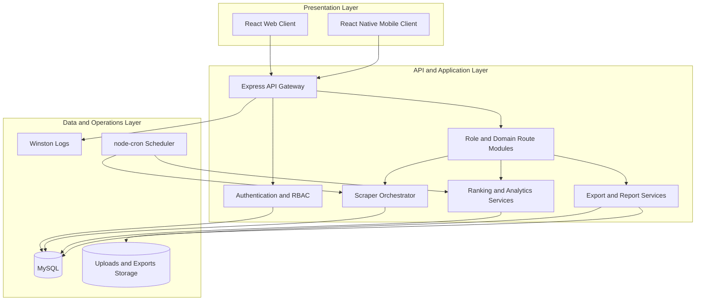
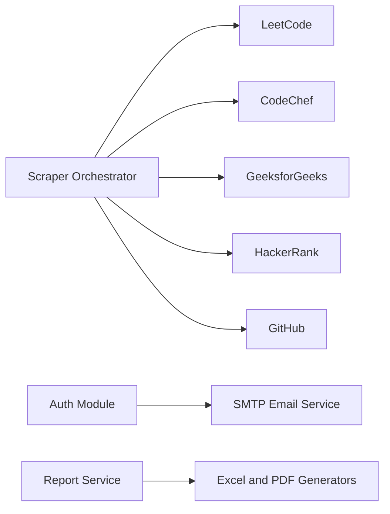
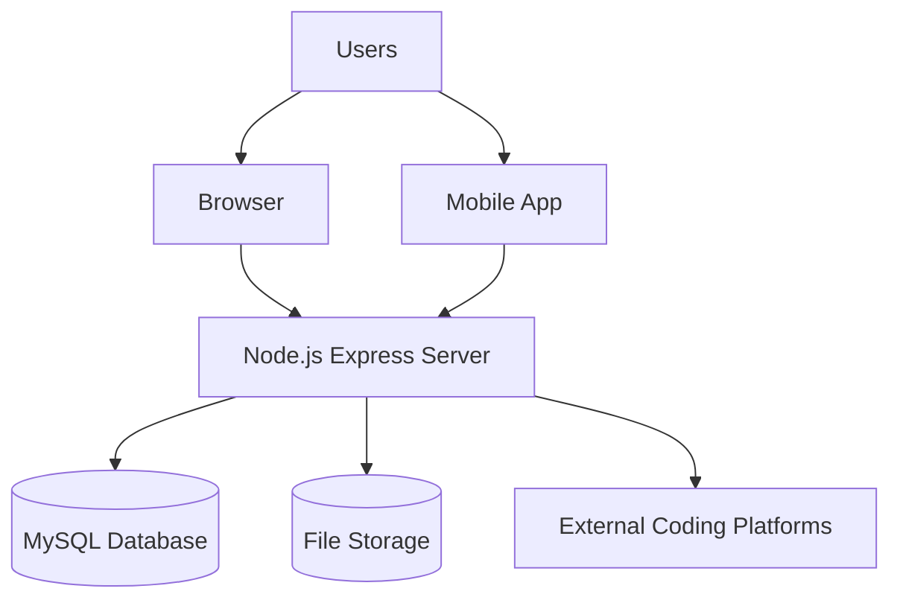
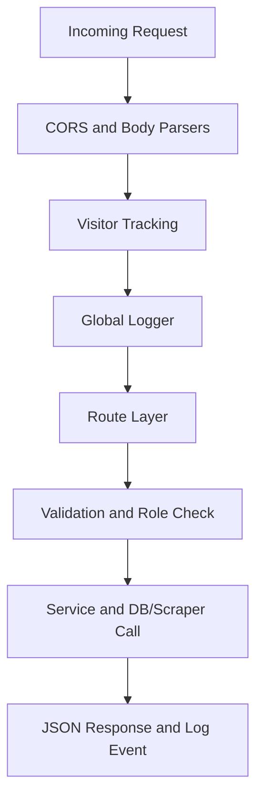
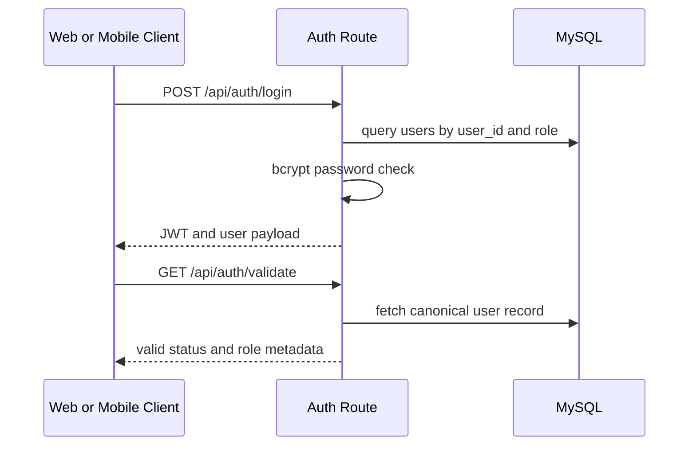
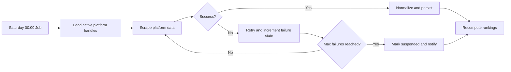
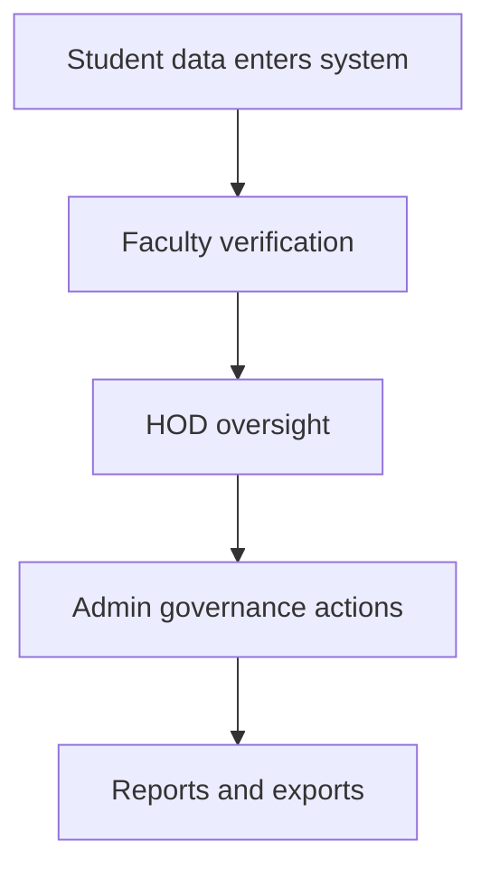
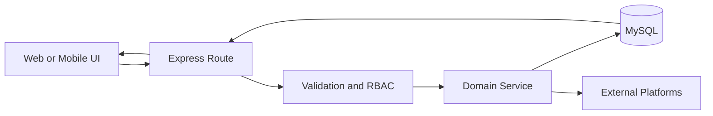
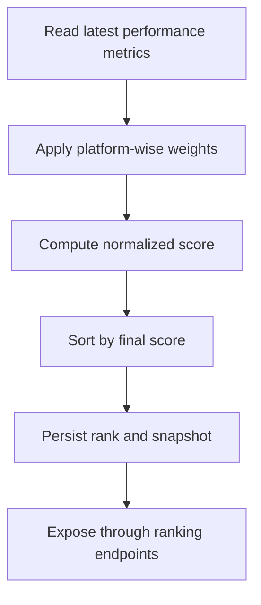
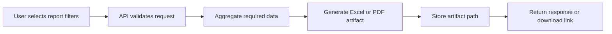

# Architecture Documentation - Code to Win

## 1. Main Idea and Objective

Code to Win is designed as a centralized coding performance intelligence platform for educational institutions. The architecture focuses on collecting fragmented coding data from multiple external sources and transforming it into trustworthy, role-specific insights.

Primary architecture goals:

- Centralize coding performance data into one relational model
- Support role-based operations for Student, Faculty, HOD, and Admin
- Automate repetitive ingestion and ranking workflows
- Keep the system modular, maintainable, and scalable
- Preserve traceability through logging, notifications, and audit-friendly flows

---

## 2. System Architecture and Design

### 2.1 Layered Architecture Model

### 2.2 Integration Topology

---

## 3. Architecture Diagrams

### 3.1 Deployment-Level View

### 3.2 Runtime Request Pipeline

---

## 4. Workflow Explanation

### 4.1 Authentication and Role Bootstrap Flow

### 4.2 Scheduled Ingestion Workflow

### 4.3 Department Governance Workflow

---

## 5. Key Modules and Responsibilities

### 5.1 Backend Modules

| Module | Responsibility |
|---|---|
| server.js | API startup, middleware chain, route registration, cron jobs |
| config/db.js | MySQL pool initialization and DB connectivity |
| routes/authRoutes.js | Login, registration, JWT validation, onboarding email integration |
| routes/studentRoutes.js | Student profile and personal performance workflows |
| routes/facultyRoutes.js | Verification and supervised student operations |
| routes/hodRoutes.js | Department-level governance and insights |
| routes/adminRoutes.js | Global platform management and administrative actions |
| routes/analyticsRoutes.js | Aggregated analytics and weekly progress endpoints |
| routes/rankingRoutes.js | Ranking retrieval and filters |
| routes/exportRoutes.js and routes/reportRoutes.js | Export generation and report orchestration |
| scrapers/* | Platform-specific scraping and parsing logic |
| scrapers/scrapeAndUpdatePerformance.js | Retry strategy, suspension model, update coordination |
| middleware/visitorTracker.js | Visitor session lifecycle monitoring |

### 5.2 Web Client Modules

| Module | Responsibility |
|---|---|
| src/context/AuthContext.jsx | Authentication lifecycle and role state |
| src/context/MetaContext.jsx | Shared metadata bootstrap |
| src/pages/* | Role-specific dashboard screens and workflows |
| src/components/* | Reusable UI blocks and modals |
| vite.config.js | API proxy and build optimization |

### 5.3 Mobile Client Modules

| Module | Responsibility |
|---|---|
| src/contexts/* | Token and app state management |
| src/navigation/* | Stack and tab route orchestration |
| src/screens/* | Role-driven mobile screens |
| src/utils.jsx | API URL and request abstraction |

---

## 6. Data Flow and Execution Flow

### 6.1 Application Data Flow

### 6.2 Ranking Execution Flow

### 6.3 Reporting Execution Flow

---

## 7. Crucial Components and Integration Details

### 7.1 Scheduler and Background Operations

- Weekly performance refresh: Saturday 00:00
- Weekly analytics snapshot: Monday 00:05
- Daily ranking refresh: 03:00
- Visitor session cleanup: every 5 minutes

### 7.2 Authentication and Security Integration

- JWT token generation and verification in auth route flow
- Password hashing and comparison using bcryptjs
- Role checks at route level to protect sensitive operations

### 7.3 Data Collection Integration

- Each platform adapter transforms external response data into normalized metrics
- Failed data fetches use retry and suspension transitions
- State transitions can trigger notification and reactivation workflows

### 7.4 Report and Export Integration

- Export routes use reporting utilities to generate structured files
- Generated files are stored and served through controlled download routes

---

## 8. Tech Stack Selection Rationale

- Node.js and Express for modular APIs and fast backend iteration
- MySQL for structured relational modeling of users, roles, and performance
- React and Vite for performant, maintainable web dashboards
- React Native and Expo for multi-device app delivery
- node-cron for deterministic time-based automation
- Winston for centralized and structured operational logging
- Axios, Cheerio, Puppeteer, Playwright Core for robust scraping across heterogeneous sources

---

## 9. Problem-Solving Approach

1. Normalize heterogeneous coding signals into one canonical model.
2. Enforce role-specific governance in every key operation.
3. Use automation to reduce manual tracking overhead.
4. Protect data quality with retries, validation, and fallback status states.
5. Enable insight and action through ranking, analytics, exports, and notifications.

---

## 10. Advantages, Benefits, Pros, and Cons

### Advantages and Benefits

- Single source of truth for coding performance
- Reduced manual intervention for faculty and administration
- Better transparency for student progress and ranking
- Extensible architecture for future platform integrations
- Shared backend for web and mobile channels

### Trade-offs and Cons

- Scraping can break when external platform structures change
- Cron-driven workflows require disciplined monitoring in production
- Configuration drift risk between web and mobile API endpoints
- Heavy report generation may require queue-based scaling in larger deployments

---

## 11. Reliability, Scalability, and Performance Design

### Reliability Patterns

- Retry and suspension strategy for unstable external sources
- Logging at request and scheduler layers for observability
- Separation of ingestion, analytics, and reporting responsibilities

### Scalability Patterns

- Route-level modular decomposition
- Service-oriented internal boundaries
- Future-ready path to split scheduler and scraping into worker services

### Performance Patterns

- Vite chunking strategy for frontend performance
- Targeted ranking update jobs instead of synchronous heavy computations per request
- Pooled DB connectivity via mysql2

---

## 12. Architecture Summary

The current architecture is a production-oriented, multi-client, role-governed full-stack system. It balances automation, data integrity, and extensibility while staying practical for institutional adoption and long-term growth.
