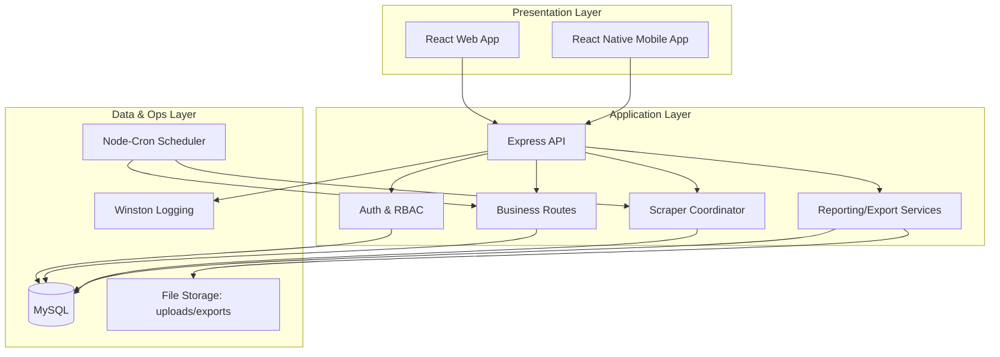
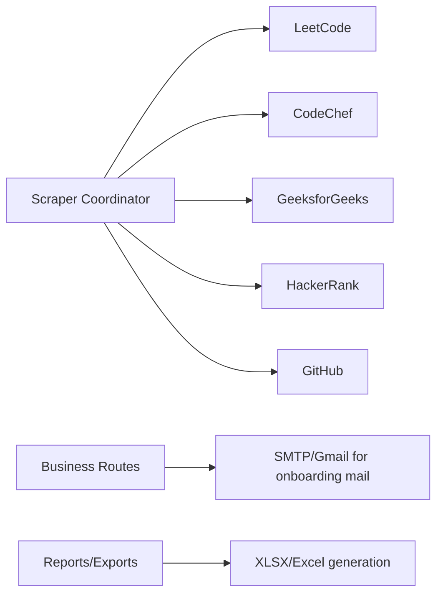
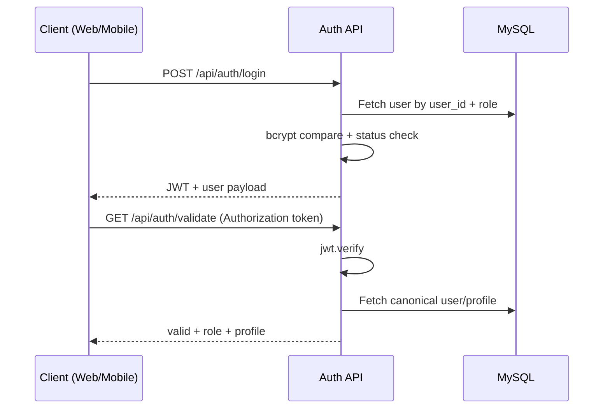
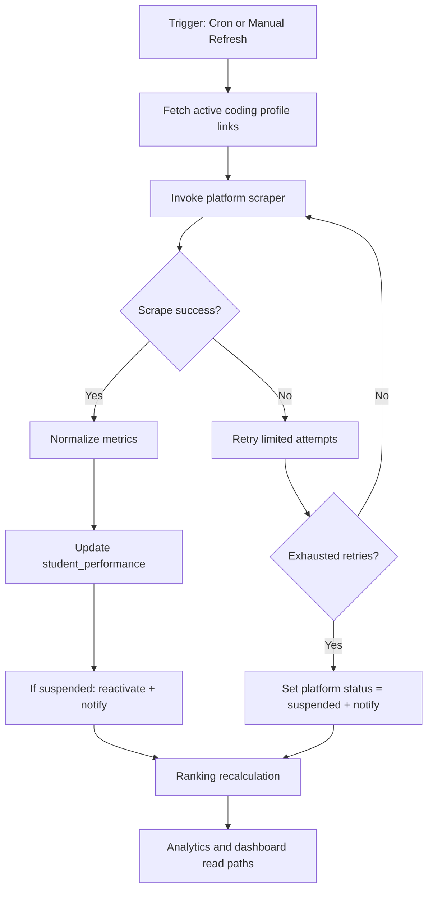
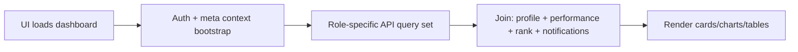
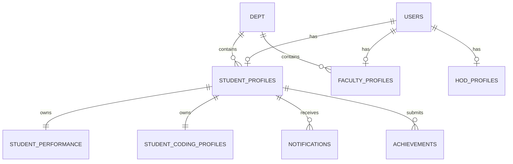

# Architecture Documentation — Code to Win

## 1. Main Idea & Objective

Code to Win is an institutional coding intelligence platform that unifies student performance from multiple competitive programming ecosystems into one governed, role-based system. The architecture is designed to:

- Aggregate heterogeneous platform data into a normalized model
- Support operational workflows for Students, Faculty, HOD, and Admin
- Provide analytics, ranking, verification, and reporting at scale
- Automate repetitive collection/update tasks while preserving traceability

---

## 2. System Architecture & Design

### 2.1 Layered Architecture

### 2.2 External Integrations

---

## 3. Key Modules & Responsibilities

## Backend (`backend/`)

| Module | Responsibility |
|---|---|
| `server.js` | API bootstrap, middleware chain, route mounting, scheduled tasks |
| `routes/authRoutes.js` | Login/register/token validation, profile bootstrap, onboarding mail |
| `routes/studentRoutes.js` | Student profile, refresh, personal dashboards |
| `routes/facultyRoutes.js` | Verification workflows, assigned student operations |
| `routes/hodRoutes.js` | Department-level governance and analytics access |
| `routes/adminRoutes.js` | Global operations and user/platform administration |
| `routes/rankingRoutes.js` | Ranking computation exposure and filter endpoints |
| `routes/analyticsRoutes.js` | KPI and weekly progress analytics |
| `routes/exportRoutes.js`, `reportRoutes.js` | Exports and report orchestration |
| `scrapers/*` | Platform-specific data extraction and parsing |
| `scrapers/scrapeAndUpdatePerformance.js` | Retry/suspension/reactivation logic + DB update coordination |
| `middleware/visitorTracker.js` | Visitor activity tracking and operational visibility |
| `config/db.js` | MySQL pool initialization via environment configuration |

## Web (`client/`)

| Module | Responsibility |
|---|---|
| `src/context/AuthContext.jsx` | Token validation, role/user state, protected flow |
| `src/context/MetaContext.jsx` | Shared metadata loading (departments/years/sections) |
| `src/App.jsx` | Role-based route map and access guards |
| `vite.config.js` | API proxy + chunking strategy |

## Mobile (`mobile/`)

| Module | Responsibility |
|---|---|
| `src/contexts/AuthContext.jsx` | Token lifecycle via AsyncStorage |
| `src/navigation/AppNavigation.jsx` | Role-resolved stack/tab navigation |
| `src/utils.jsx` | API base URL + fetch abstraction |

---

## 4. Workflow & Execution Architecture

### 4.1 Authentication/Authorization Execution Flow

### 4.2 Data Collection & Performance Update Flow

### 4.3 Dashboard Read Flow

---

## 5. Data Architecture

### 5.1 High-Level Entity Relationship View

### 5.2 Data Consistency Strategy

- Numeric coercion in scraper coordinator before persistence
- Route-level validation and role checks
- Suspension model for unstable external integrations
- Notification events emitted on state transition (suspended → accepted)

---

## 6. Crucial Components & Integration Details

## 6.1 Scheduler Integration

- Weekly scraping execution (Saturday)
- Weekly snapshot capture (Monday)
- Daily ranking refresh
- 5-minute visitor cleanup job

## 6.2 Report & Export Integration

- Export routes invoke service logic to produce XLSX/report artifacts
- Files are persisted in project-managed storage directories
- Download routes expose artifacts with access control

## 6.3 Email Integration

- Auth route uses SMTP transport rotation (`EMAIL_USER_*`, `EMAIL_PASS_*`)
- New registration communication is sent after successful creation flow

---

## 7. Tech Stack Choices (Why These)

- **Node + Express**: lightweight API composition and route modularity
- **MySQL**: relational consistency for role/profile/performance model
- **React + Vite**: rapid development and optimized frontend delivery
- **React Native + Expo**: fast mobile rollout with a shared product domain
- **node-cron**: deterministic recurring operational tasks
- **Winston**: structured logging for observability and issue triage
- **Puppeteer/Cheerio/Axios**: adaptable scraping across static/dynamic targets

---

## 8. Problem-Solving Approach

1. **Normalize scattered coding signals** into one canonical schema
2. **Automate ingestion** to reduce manual reporting overhead
3. **Protect data quality** with retries, status transitions, and logging
4. **Enable governance** via role-centric route segregation
5. **Deliver actionable insights** through rankings, analytics, and exports

---

## 9. Advantages, Benefits, Pros & Cons

## Advantages / Pros

- Unified academic + placement coding intelligence
- Reduced manual tracking burden for faculty/admin teams
- Strong extensibility for new routes/platform integrations
- Transparent operational trail through logging and notifications

## Trade-offs / Cons

- External platform scraping can be brittle to markup/API changes
- Cron-heavy behavior requires careful production monitoring
- Mobile and web endpoint configuration must stay synchronized
- Data freshness depends on schedule frequency and scraping success

---

## 10. Reliability, Security, and Scalability Considerations

## Security

- JWT authentication and role-gated routes
- Hashed password validation (bcrypt)
- Controlled exposure of uploads and route-level data access

## Reliability

- Retry strategy in scraping pipeline
- Automatic status fallback to suspended for repeated failures
- Centralized logging for post-mortem/debugging

## Scalability

- Modular route/scraper decomposition
- Clear separation between ingestion, query, and reporting concerns
- Future option to split scheduler/scraper into dedicated worker process

---

## 11. Architecture Summary

The current architecture is a practical, production-oriented monorepo design balancing **feature velocity**, **operational automation**, and **institutional governance**. It is especially strong for campuses requiring consolidated coding-performance management with both web and mobile access.
