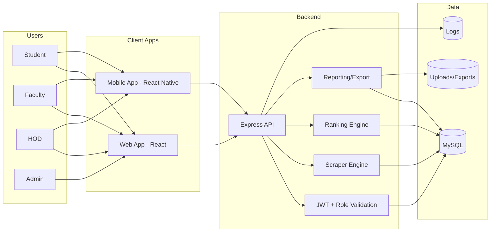
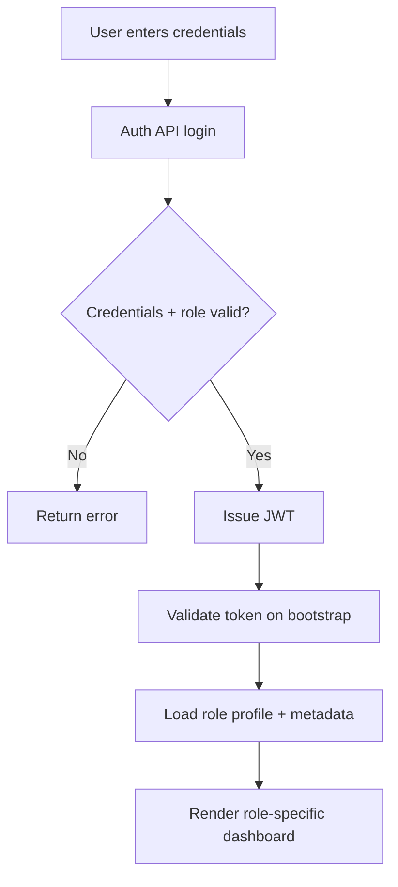
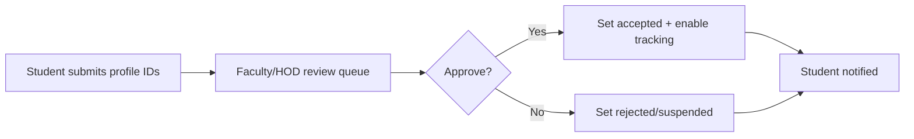
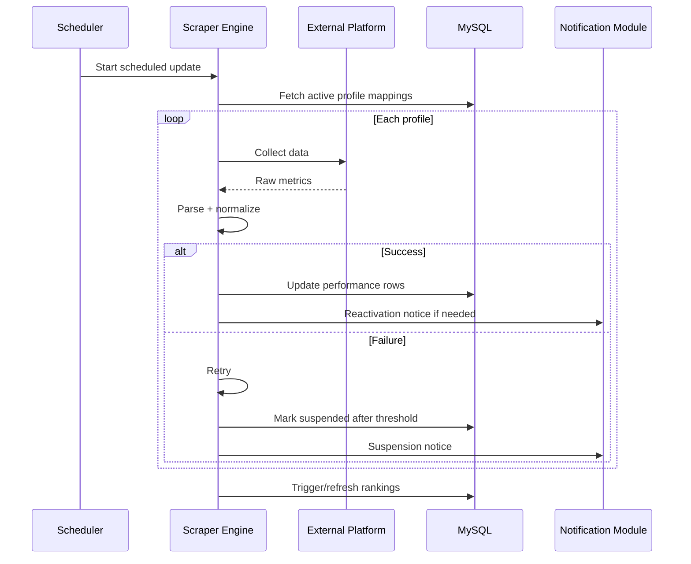
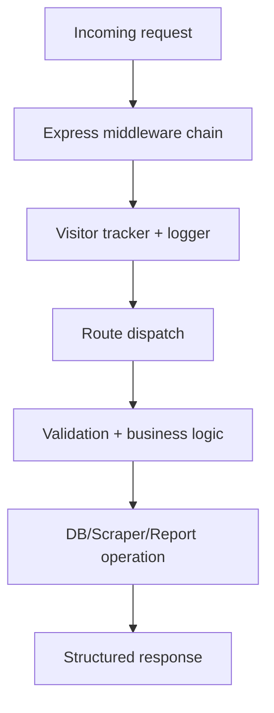
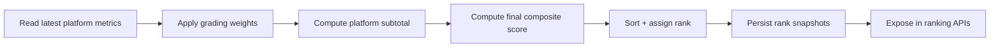
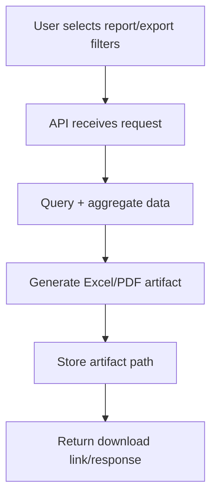
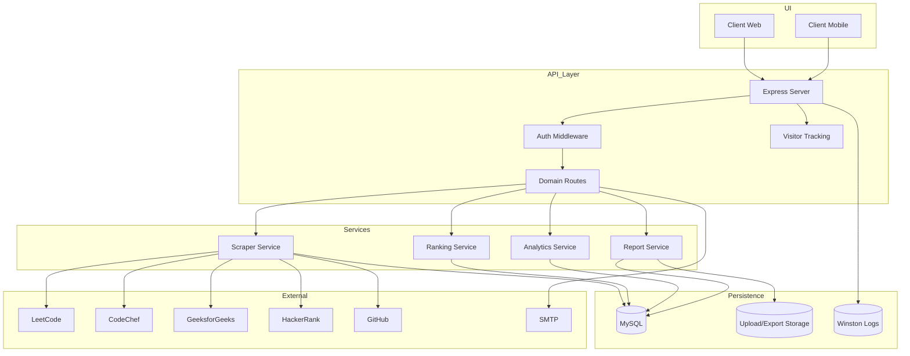

# Project Documentation — Code to Win

## 1. Executive Summary

Code to Win is a full-stack institutional platform that consolidates coding performance metrics from major competitive programming ecosystems and turns them into verifiable, role-based operational intelligence.

It enables:

- Student progress visibility
- Faculty verification workflows
- HOD-level academic oversight
- Admin-level governance and analytics

---

## 2. Main Idea & Objective

## Problem Statement

Educational institutions struggle to track coding competency consistently because student activity is fragmented across multiple external platforms.

## Objective

Create a unified system that:

1. Collects coding data automatically
2. Normalizes and stores it reliably
3. Computes transparent rankings
4. Serves role-specific dashboards
5. Supports reporting/export for placement and academics

---

## 3. End-to-End System View



---

## 4. Detailed Workflow Explanation

## 4.1 User Access Workflow



## 4.2 Coding Profile Verification Workflow



## 4.3 Performance Update Workflow



---

## 5. Module Breakdown and Responsibilities

## 5.1 Backend Core Modules

- **Authentication module**: login, registration, token validation
- **Role route modules**: student/faculty/hod/admin operational APIs
- **Scraper modules**: platform adapters for LeetCode/CodeChef/GFG/HackerRank/GitHub
- **Ranking module**: score computation and ordered ranking outputs
- **Analytics module**: KPI and progress trends
- **Report/export module**: generation and retrieval of artifacts
- **Middleware module**: visitor tracking, upload handling
- **Scheduling module**: periodic ingestion and maintenance jobs

## 5.2 Frontend Modules (Web)

- Auth context and protected routes
- Role-specific dashboards
- Ranking and filter components
- Modal workflows for profile and governance operations
- Analytics and export interfaces

## 5.3 Frontend Modules (Mobile)

- Token persistence via AsyncStorage
- Role-aware navigation stack/tab model
- Student/faculty/HOD optimized mobile screens
- Notification and quick status visibility

---

## 6. Data Flow & Execution Flow

### 6.1 Request-Level Execution Flow



### 6.2 Ranking Execution Flow



### 6.3 Reporting Execution Flow



---

## 7. Architecture Diagram (Detailed)



---

## 8. Tech Stack and Rationale

| Technology | Role | Rationale |
|---|---|---|
| React + Vite | Web UX | Fast build pipeline, route-driven dashboards |
| React Native + Expo | Mobile UX | Efficient multi-platform mobile delivery |
| Node.js + Express | API | Flexible modular REST backend |
| MySQL | Data model | Strong relational fit for role/profile/performance data |
| JWT + bcrypt | Security | Stateless auth and secure credential handling |
| node-cron | Automation | Predictable scheduled maintenance and data refresh |
| Cheerio/Axios/Puppeteer | Scraping | Handles static and dynamic data surfaces |
| Winston | Observability | Structured operational logging |

---

## 9. Problem-Solving Approach

- **Fragmentation challenge** solved by unifying profile metrics into normalized schema
- **Freshness challenge** solved by cron schedules + manual refresh routes
- **Data quality challenge** solved by retry/suspend/reactivate lifecycle
- **Governance challenge** solved through role-bound APIs and UX flows
- **Decision support challenge** solved via ranking + analytics + export layer

---

## 10. Advantages, Benefits, Pros and Cons

## Benefits / Pros

- Institutional visibility of coding readiness
- Lower manual operational burden
- Strong role separation and accountability
- Portable architecture supporting web and mobile channels
- Data-driven placement and academic review workflows

## Limitations / Cons

- Scraping reliability can change with external platform updates
- Requires careful endpoint/port consistency between clients and backend
- Scheduling and scraping workloads need monitoring in production
- Some advanced admin operations are web-only by design in mobile flow

---

## 11. Crucial Components & Integration Details

- **Auth integration**: token issuance and validation governs all protected workflows
- **Scraper integration**: each platform adapter maps to common metric format
- **Notification integration**: profile status transitions produce user-facing alerts
- **Export integration**: report generation persists artifacts for retrieval
- **Ops integration**: PM2-friendly backend process model + scheduled jobs

---

## 12. Deployment & Local Run Guidance

## Backend

```bash
cd backend
npm install
npm run dev
```

## Web

```bash
cd client
npm install
npm run dev
```

## Mobile

```bash
cd mobile
npm install
npm start
```

## Validation

```bash
cd backend && npm test
cd ../client && npm run lint && npm run build
cd ../mobile && npm run lint
```

---

## 13. Operational Recommendations

- Keep `PORT` and client API targets aligned (`client/vite.config.js`, `mobile/src/utils.jsx`)
- Monitor scheduled jobs and scraper failures via logs
- Version and review grading rules for ranking consistency
- Add automated integration tests around critical auth/ranking/report endpoints

---

## 14. Final Notes

This project is architected as a practical production system for educational institutions. It combines automation, governance, analytics, and user experience in a coherent structure that is both extensible and operationally effective.
