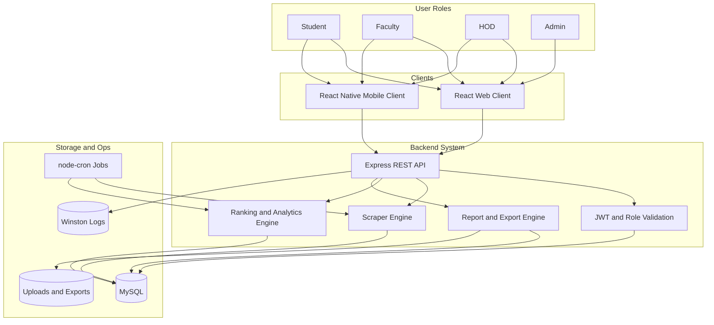
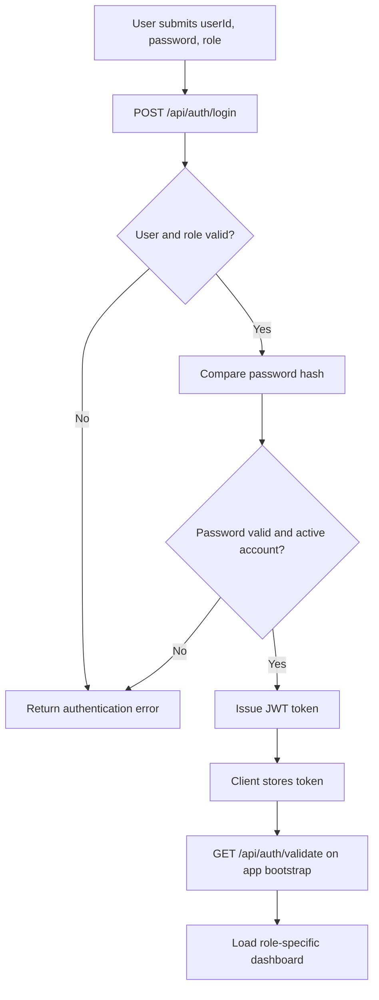
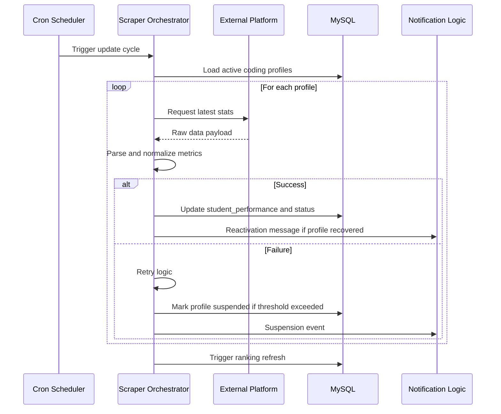
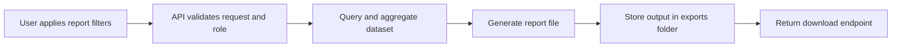
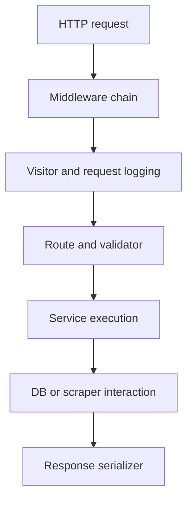
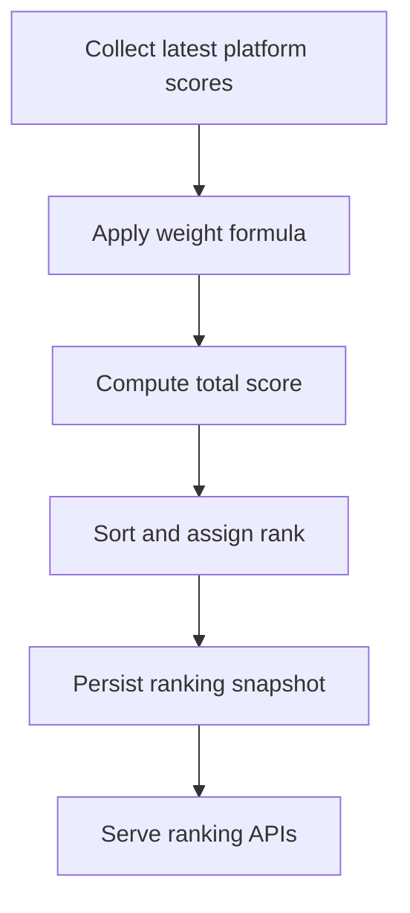
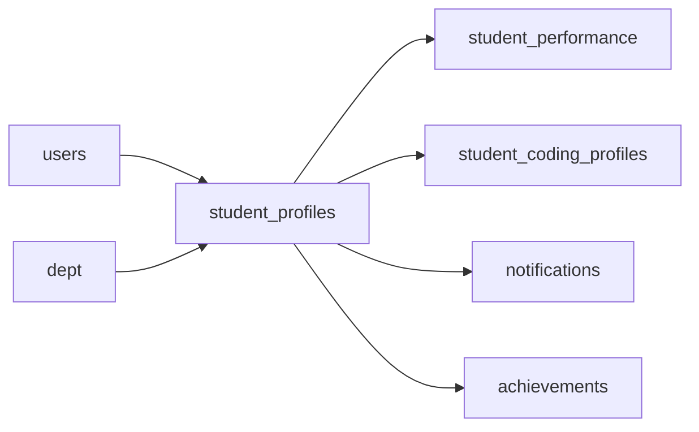

# Project Documentation - Code to Win

## 1. Executive Summary

Code to Win is a full-stack coding performance management platform that connects web and mobile clients to a shared backend and database. It consolidates student coding data from external platforms, supports institutional governance workflows, and provides ranking, analytics, and reporting capabilities.

This document captures complete project-level implementation guidance, architecture behavior, execution flow, setup details, testing strategy, and validation procedures.

---

## 2. Main Idea and Objective

### Problem Context

Student coding activity is distributed across multiple third-party services, making reliable academic and placement evaluation difficult.

### Main Objective

Deliver a unified, scalable, and role-governed system that:

1. Collects coding data automatically from multiple platforms
2. Normalizes and stores performance in a structured model
3. Provides transparent ranking and analytics
4. Supports verification workflows for institutional control
5. Generates downloadable reports and export artifacts

---

## 3. End-to-End System Architecture



---

## 4. Detailed Workflow Explanation

### 4.1 Authentication and Session Workflow



### 4.2 Data Ingestion and Refresh Workflow



### 4.3 Reporting and Export Workflow



---

## 5. Module-Level Documentation

### 5.1 Backend Modules

- Authentication routes: login, registration, token validation
- Student, faculty, HOD, admin routes: role-segregated business logic
- Scraper modules: platform-level data extraction and normalization
- Ranking module: score computation and leaderboard ordering
- Analytics module: trend and snapshot endpoints
- Export/report modules: structured artifacts for download
- Middleware: visitor tracking and upload handling
- Scheduler: recurring ingestion, ranking, and cleanup operations

### 5.2 Web Modules

- Context providers for auth and metadata
- Role-aware route rendering and dashboard access
- Components for ranking, filtering, and management actions
- Visualization and report interaction surfaces

### 5.3 Mobile Modules

- Async token persistence and validation
- Navigation orchestration across role-specific screens
- API utility abstraction and mobile-optimized workflows

---

## 6. Data Flow and Execution Flow

### 6.1 API Execution Flow



### 6.2 Ranking Execution Flow



### 6.3 Data Dependency Map



---

## 7. Tech Stack and Why It Was Chosen

| Technology | Layer | Reason |
|---|---|---|
| Node.js and Express | Backend API | Clean modular routing and fast development speed |
| MySQL and mysql2 | Data | Strong relational consistency for role-driven model |
| React and Vite | Web | Fast builds and maintainable component architecture |
| React Native and Expo | Mobile | Cross-platform mobility with shared product context |
| JWT and bcryptjs | Security | Stateless authentication and secure password checks |
| node-cron | Automation | Predictable recurring job execution |
| Axios, Cheerio, Puppeteer, Playwright Core | Data ingestion | Supports mixed static and dynamic external pages |
| Winston | Operations | Centralized structured logging and diagnostics |

---

## 8. Problem-Solving Approach

1. Design canonical schemas for fragmented data.
2. Build role-based APIs for controlled access.
3. Automate ingestion to minimize manual effort.
4. Guard reliability with retries, suspension states, and logs.
5. Deliver actionable outcomes through dashboards and reports.

---

## 9. Advantages, Benefits, Pros and Cons

### Advantages and Benefits

- Unified performance visibility across coding platforms
- Better governance and accountability through RBAC flows
- Reduced manual tracking effort for faculty and admins
- Mobile and web parity over a shared backend
- Extensible module boundaries for future growth

### Pros

- Strong separation of concerns
- Production-friendly automation hooks
- Practical report and export support

### Cons and Constraints

- Scraper maintenance overhead as external sites evolve
- Environment alignment needed across web, backend, and mobile
- Cron and scraping load must be monitored at scale

---

## 10. Crucial Components and Integration Details

### Authentication Integration

- JWT tokens are issued at login and validated on session bootstrap
- User identity and role are revalidated against database state

### Platform Integration

- Scrapers pull data from LeetCode, CodeChef, GeeksforGeeks, HackerRank, and GitHub
- Results are normalized before persistence to prevent schema drift

### Scheduling Integration

- Weekly full update job for student performance
- Weekly analytics snapshot job
- Daily ranking refresh job
- Frequent visitor cleanup maintenance job

### Export Integration

- Export endpoints generate and persist artifacts in storage directories
- Download endpoints expose generated files through controlled APIs

---

## 11. Setup and Installation Guide

### 11.1 Prerequisites

- Node.js 18+
- npm 9+
- MySQL 8+
- Expo tooling for mobile execution

### 11.2 Installation

```bash
git clone <repository-url>
cd code_to_win
npm install
cd backend && npm install
cd ../client && npm install
cd ../mobile && npm install
```

### 11.3 Backend Environment Configuration

Create backend/.env with:

```env
DB_HOST=localhost
DB_USER=your_mysql_user
DB_PASS=your_mysql_password
DB_NAME=code_to_win
PORT=5000
JWT_SECRET=your_secure_secret
EMAIL_USER_1=mail_account_1
EMAIL_PASS_1=mail_password_1
EMAIL_USER_2=mail_account_2
EMAIL_PASS_2=mail_password_2
```

### 11.4 Database Initialization

```sql
CREATE DATABASE code_to_win;
```

Apply migration files and schema scripts from backend/migrations and project SQL assets.

### 11.5 Endpoint Configuration

- Web proxy target is configured in client/vite.config.js
- Mobile API URL is configured in mobile/src/utils.jsx and should match your reachable backend host

---

## 12. Run and Usage Instructions

### Run backend and web together

```bash
npm run dev
```

### Run modules manually

```bash
cd backend && npm run dev
cd client && npm run dev
cd mobile && npm start
```

### Usage by role

- Student: monitor profile status, performance, and rank
- Faculty: verify students and track section-level outcomes
- HOD: review department-wide performance and oversight queues
- Admin: manage global operations and analytics exports

---

## 13. Testing Strategy and Validation Checks

### 13.1 Static and Syntax Validation

```bash
cd backend
npm test
```

### 13.2 Integration Validation Matrix

- Authentication success and failure paths
- Token validation and role-specific route access
- Scraper update run for each supported platform
- Ranking consistency after refresh jobs
- Report generation and file download checks
- Mobile and web behavior against same backend

### 13.3 Non-Functional Validation

- Responsiveness checks for web across breakpoints
- API latency checks for key dashboard endpoints
- Error handling checks on scraper failures and retries
- Log validation for cron and route events

---

## 14. Verification Steps for Production Readiness

1. Ensure all environment variables are set correctly.
2. Run backend syntax checks and resolve any issues.
3. Validate database connectivity and migration integrity.
4. Execute login and role routing checks on web and mobile.
5. Run a controlled scraping cycle and verify DB updates.
6. Trigger ranking refresh and validate leaderboard consistency.
7. Generate and download at least one export artifact.
8. Confirm cron jobs execute with expected logs.
9. Validate responsive behavior on desktop and mobile views.
10. Review logs for warnings or unhandled exceptions.

---

## 15. Final Notes

This documentation set is intended to make the project implementation, architecture, and operations transparent and production-focused. For architecture-specific depth, refer to architecture.md. For fast onboarding and run instructions, refer to README.md.
- **Freshness challenge** solved by cron schedules + manual refresh routes
- **Data quality challenge** solved by retry/suspend/reactivate lifecycle
- **Governance challenge** solved through role-bound APIs and UX flows
- **Decision support challenge** solved via ranking + analytics + export layer

---

## 10. Advantages, Benefits, Pros and Cons

## Benefits / Pros

- Institutional visibility of coding readiness
- Lower manual operational burden
- Strong role separation and accountability
- Portable architecture supporting web and mobile channels
- Data-driven placement and academic review workflows

## Limitations / Cons

- Scraping reliability can change with external platform updates
- Requires careful endpoint/port consistency between clients and backend
- Scheduling and scraping workloads need monitoring in production
- Some advanced admin operations are web-only by design in mobile flow

---

## 11. Crucial Components & Integration Details

- **Auth integration**: token issuance and validation governs all protected workflows
- **Scraper integration**: each platform adapter maps to common metric format
- **Notification integration**: profile status transitions produce user-facing alerts
- **Export integration**: report generation persists artifacts for retrieval
- **Ops integration**: PM2-friendly backend process model + scheduled jobs

---

## 12. Deployment & Local Run Guidance

## Backend

```bash
cd backend
npm install
npm run dev
```

## Web

```bash
cd client
npm install
npm run dev
```

## Mobile

```bash
cd mobile
npm install
npm start
```

## Validation

```bash
cd backend && npm test
cd ../client && npm run lint && npm run build
cd ../mobile && npm run lint
```

---

## 13. Operational Recommendations

- Keep `PORT` and client API targets aligned (`client/vite.config.js`, `mobile/src/utils.jsx`)
- Monitor scheduled jobs and scraper failures via logs
- Version and review grading rules for ranking consistency
- Add automated integration tests around critical auth/ranking/report endpoints

---

## 14. Final Notes

This project is architected as a practical production system for educational institutions. It combines automation, governance, analytics, and user experience in a coherent structure that is both extensible and operationally effective.
